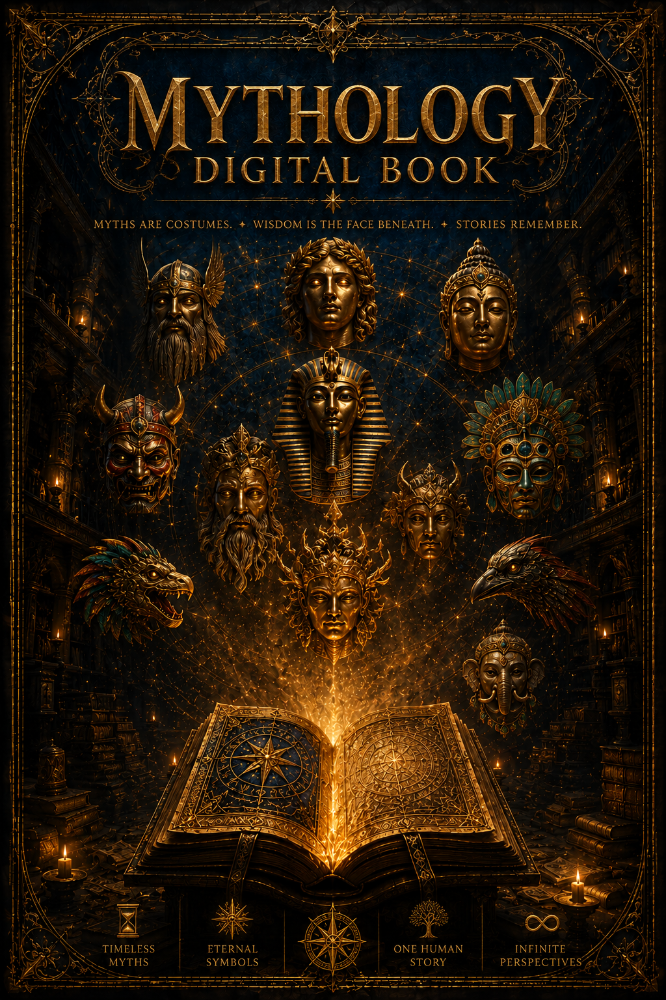
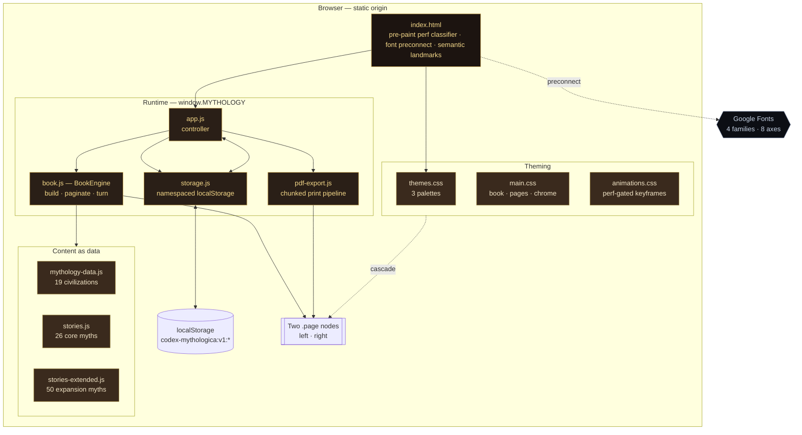
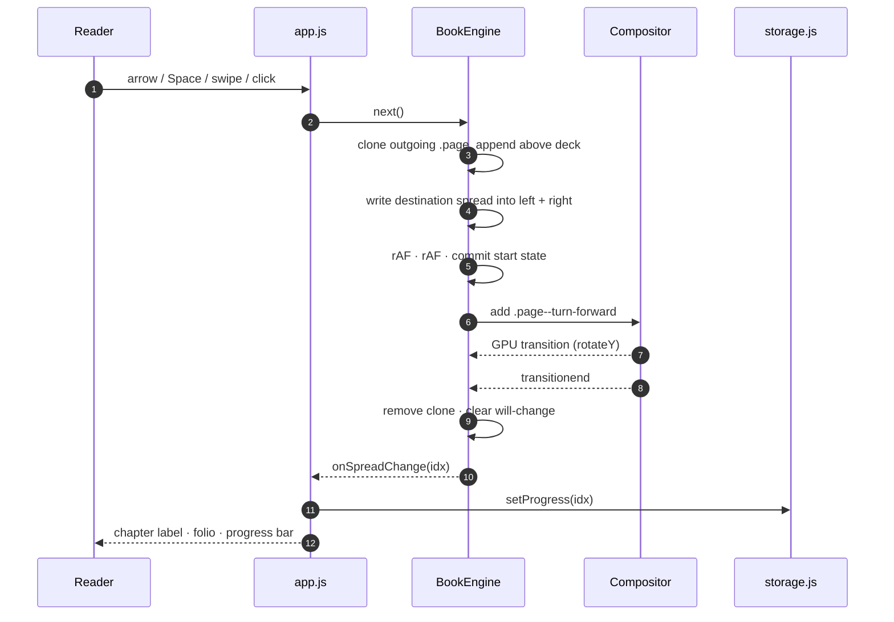
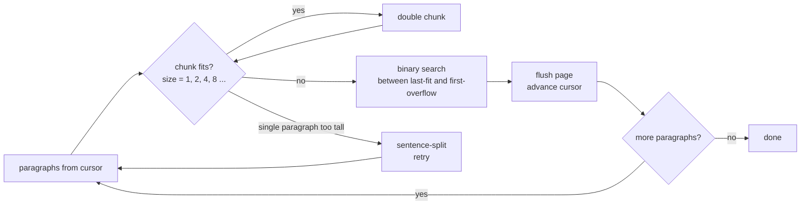
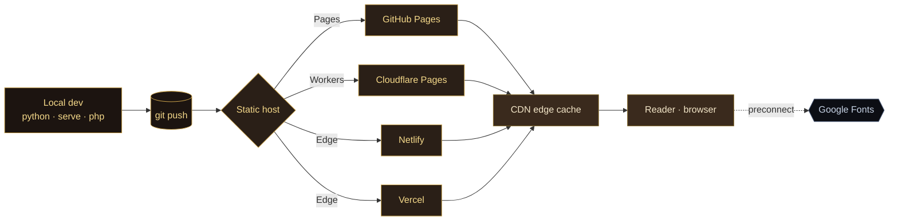

<div align="center">

# Codex Mythologica

#### *An Illuminated Archive of the Ancient World*

A browser-native interactive codex that binds **76 long-form myths** from **19 civilizations** into a single tactile reading experience — no framework, no build step, no backend.

[](#tech-stack)
[](#tech-stack)
[](#build--deployment)
[](#performance)
[](#accessibility)
[](#license)

<br />



</div>

---

## Overview

`Codex Mythologica` is a fully client-side digital book that paginates roughly **88,000 words** of original literary retellings into hardcover spreads, with measurement-driven pagination, GPU-composited 3D page turns, three ambient themes, persistent reading state, and a print-quality PDF export. The entire runtime weighs **~145 KB** of hand-authored HTML, CSS, and JavaScript with **zero** third-party packages.

It exists as a study in how far the modern browser can go *unaided* — production-grade typography, real layout pagination, accessibility primitives, and 60 fps animation served from a static directory. The same three principles show up in the larger systems I build:

- **Dependency restraint** — runtime cost you don't pay is the one that never breaks.
- **Performance as a feature** — auto-detected render modes, cooperative scheduling, ~500 ms cold build for a 446-page document.
- **Content as data** — chapters are plain JS objects; the engine, layout, and presentation evolve independently of the prose.

---

## Highlights

- **76 illuminated chapters** across Hellenic, Kemet, Norðr, Yamato, Bharatiya, Ériu, Sumer, Mēxihcah, Romana, Zhōnghuá, Hangug, Maya, Slovjan, Yorùbá / Ashanti / Nyanga, Pārs, Mā'ohi, Inuit, Türk, and ʿArab traditions.
- **Custom page engine** — measurement-based pagination with chunked exponential-then-binary search (~7 layout reads / page).
- **3D page turn** rendered on the compositor with `transform` + `opacity` only — no JS-driven inline transforms during the animation.
- **Three ambient themes** — *midnight*, *parchment*, *obsidian* — each a full CSS custom-property palette.
- **Five-step reading typography** that re-paginates in place and re-anchors to the current chapter.
- **Searchable, civilization-filtered Tabula** + a bookmark drawer with timestamps and a visible ribbon on marked folios.
- **PDF export** via a print-optimized stylesheet — text stays text, no `jsPDF` or `html2canvas`.
- **Performance Mode** with pre-paint device classification (cores · memory · pointer · reduced-motion).
- **Keyboard, swipe, and ARIA-correct controls**; full-screen reader mode.

---

## System Architecture

The runtime is intentionally small and explicit. A single global namespace (`window.MYTHOLOGY`) hosts four discrete modules; the boot script in `index.html` classifies the device before first paint so the right palette and animation budget land on the very first frame.



The indirection cost of a module loader would dwarf the size of the modules themselves, so the codex stays at script-tag granularity — explicit, debuggable from the console, and trivial to vendor.

---

## The Page Engine

`BookEngine` synthesises a flat array of page descriptors — cover, blanks, title, two-page Tabula, then for each story a chapter-opening folio (always landing on a right-hand page) followed by N body pages produced by measurement-driven pagination. The full set is zipped into spreads, and exactly **two** DOM nodes (`.page--left`, `.page--right`) live in the document at any moment.

A page turn lifts a clone of the outgoing page above the deck with a `rotateY` transform owned entirely by CSS, awaited via `transitionend`. The destination spread is pre-rendered underneath, so when the clone unmounts the next folio is already there.



### Pagination

Body content is measured against an off-screen `.page__content` clone the engine mounts only during build. Each story is paginated with a chunked exponential-then-binary search:



For an average 25-paragraph story this comes out to **~6–7 layout reads per page** instead of one per paragraph — roughly 3× fewer reads than the naive greedy version, with sub-linear scaling in chapter length. Resize, theme, and font-size changes trigger an idle-scheduled rebuild that re-anchors the reader to the same chapter.

### Performance Mode

The codex classifies the device before first paint with a tiny inline script in `<head>` — no FOUC, no flash:

| Mode      | Trigger                                                                                  | What changes                                                                                       |
| --------- | ---------------------------------------------------------------------------------------- | -------------------------------------------------------------------------------------------------- |
| **Rich**  | desktop, ≥ 4 cores, ≥ 4 GB RAM, fine pointer                                             | Ambient nebula + dust drift, 3D rotateY flip, drop-cap glow, parchment textures, backdrop blur     |
| **Lite**  | low-core / low-mem devices, coarse pointer on small viewport, `prefers-reduced-motion`   | Opacity crossfade, no ambient drift, simplified shadows — ~70 % less paint work per frame          |

`X` toggles manually; the choice persists in `localStorage` and is re-applied pre-paint on the next visit.

---

## Tech Stack

| Layer        | Choice                                                                 | Why                                                                            |
| ------------ | ---------------------------------------------------------------------- | ------------------------------------------------------------------------------ |
| Runtime      | Vanilla JavaScript (ES2020)                                            | Zero framework cost; ships exactly what runs                                   |
| Markup       | Semantic HTML5, ARIA landmarks                                         | Real accessibility tree and SEO from the ground up                             |
| Styling      | CSS3 custom properties, `@media print`, GPU-composited transforms      | Theme switching via root vars; print engine reuses the cascade                 |
| Typography   | Cinzel · Cormorant Garamond · EB Garamond · UnifrakturMaguntia         | 4 families × 8 axes (trimmed from a sprawl of 5 × 30)                          |
| Persistence  | `localStorage`, namespaced `codex-mythologica:v1:*`                    | Reading position, bookmarks, theme, type scale, performance mode               |
| Build system | *None*                                                                 | Hand-authored modules served as-is; no transpile, no bundle, no watch          |
| Hosting      | Any static host                                                        | Verified on Python `http.server`, GitHub Pages, Cloudflare Pages, and Netlify  |

No React, Vue, Tailwind, Bootstrap, jQuery, jsPDF, html2canvas, or service worker.

---

## Folder Structure

```
mythology-digital-book/
├── index.html                   # shell, pre-paint perf detection, font preconnect
├── styles/
│   ├── themes.css               # 3 palettes (midnight / parchment / obsidian)
│   ├── main.css                 # book, pages, chrome, drawers
│   └── animations.css           # page-turn, ambient drift, micro-interactions
├── scripts/
│   ├── storage.js               # namespaced localStorage wrapper
│   ├── book.js                  # BookEngine: build · paginate · flip · navigate
│   ├── pdf-export.js            # print-optimized PDF rendering pipeline
│   └── app.js                   # controller: chrome, drawers, hotkeys, swipe
├── content/
│   ├── mythology-data.js        # civilization metadata + book metadata
│   ├── stories.js               # 26 core myths
│   └── stories-extended.js      # 50 expansion myths (19-civilization rollout)
├── assets/                      # decorations · icons · textures (reserved)
└── libs/                        # reserved for vendored deps (currently empty)
```

---

## Local Development

The codex must be served over HTTP — browsers refuse font loading and certain `fetch` paths from `file://`. From the repo root:

```bash
# any static server works
python3 -m http.server 8000
# or
npx serve .
# or
php -S localhost:8000
```

Then open <http://localhost:8000>. No install, no build, no watch task.

After the first load the browser caches the four font families and the codex behaves as a fully offline experience. To remove the only network dependency entirely, self-host the fonts referenced in `index.html`.

### Controls

| Key                           | Action                                |
| ----------------------------- | ------------------------------------- |
| `←` `→` `Space` `PgUp` `PgDn` | Turn page                             |
| `Home` / `End`                | Jump to cover / colophon              |
| `T`                           | Tabula (table of contents)            |
| `B`                           | Bookmark current spread               |
| `M`                           | Open marked folios                    |
| `V`                           | Cycle ambient theme                   |
| `A`                           | Cycle reading typography size         |
| `X`                           | Toggle Performance Mode               |
| `F`                           | Toggle fullscreen                     |
| `P`                           | Export PDF (browser print dialog)     |
| `Esc`                         | Close drawer · leave fullscreen       |

Touch devices: horizontal swipe on the book turns pages.

---

## Build & Deployment

There is no build step. The repository is a deployable artifact as-is.



```bash
# GitHub Pages
git push origin main
# then: Settings → Pages → Deploy from branch → main → /(root)

# Cloudflare Pages / Netlify / Vercel
# Build command:    (leave empty)
# Output directory: ./
```

**Recommended cache headers**

- `Cache-Control: public, max-age=31536000, immutable` for `content/*.js` (text rarely changes)
- `Cache-Control: public, max-age=86400` for `styles/*.css` and `scripts/*.js`
- `Cache-Control: no-cache` for `index.html`

Local production-feel testing: prefer a server that sets correct MIME types — both `python3 -m http.server` and `npx serve` do.

---

## Performance

| Metric                                         | Value                                       |
| ---------------------------------------------- | ------------------------------------------- |
| Total HTML + CSS + JS                          | ~145 KB                                     |
| Content (text JS, all 76 myths)                | ~520 KB (~140 KB gzipped, estimated)        |
| `.page` elements live in the DOM               | exactly **2**                               |
| Full build (76 chapters, 446 pages)            | ~500 ms on a modern desktop                 |
| Layout reads per page during pagination        | ~7                                          |
| Page-turn frame rate                           | 60 fps (transform + opacity only)           |
| Runtime dependencies                           | **0**                                       |
| Network requests after first paint             | Google Fonts (cacheable · self-hostable)    |

### What was optimised away

- Full-page SVG `feTurbulence` noise filter — the single largest paint cost.
- All `mix-blend-mode: multiply` declarations — were defeating GPU compositing.
- Box-shadow transitions during page turn — replaced with a static curl gradient.
- Infinite `filter: drop-shadow()` on cover crest, sigil, and drop-caps.
- The `inset 0 0 80px` book shadow — inset blurs cost the full page area per frame.
- Backdrop-filter blur on chrome reduced from 14 px → 6 px (removed entirely in lite).
- `background-position` ambient animations → `transform: translate` (compositor-only).
- ~22 unused font axes (Playfair Display dropped entirely).

### Cooperative scheduling

- Pagination yields every 6 chapters via `requestIdleCallback`; the loader text updates `N/76` so a slow boot never looks frozen.
- PDF export streams chapters in 3-chapter chunks across idle frames so the UI stays interactive during a 30,000-word build.
- Ambient nebula and dust drift pause when the tab is hidden (`visibilitychange`).
- Resize handler ignores deltas below 80 × 60 px — eliminates scrollbar-noise rebuilds.
- `will-change` is set on a turning page only for the duration of the turn, then released — no leaked GPU layers.

---

## Accessibility

- Semantic landmarks throughout (`<header>`, `<main>`, `<footer>`, `<nav>`, `<aside>`).
- Drawer dialogs declare `role="dialog"` and `aria-modal="true"`; focus moves to the close button on open.
- Every chrome button carries an `aria-label` and a visible `title` tooltip.
- Non-blocking notifications via `aria-live="polite"` toast region.
- Text rendered as text throughout — no canvas, no images-of-text, fully selectable and indexable.
- Three palettes cover high-contrast, daylight, and night reading.
- Five-step typography scale (0.92 → 1.36) with full re-pagination.
- `prefers-reduced-motion` short-circuits the 3D flip into a crossfade automatically.

---

## Security

- All dynamic content is escaped via a strict HTML-entity escaper before insertion (`escapeHtml` in `book.js`, `pdf-export.js`, `app.js`).
- No `eval`, no `Function()`, no third-party scripts beyond the Google Fonts stylesheet.
- No remote endpoints, no cookies, no fingerprinting — `localStorage` is the only persistence layer and is namespaced to `codex-mythologica:v1:*`.
- A future PWA upgrade (see [Roadmap](#roadmap)) would benefit from a strict CSP and SRI on the font stylesheet.

---

## Roadmap

- [ ] Self-host the four font families to eliminate the Google Fonts dependency entirely.
- [ ] PWA wrapper — service worker, install prompt, true offline-first.
- [ ] Read-aloud mode using the Web Speech API with per-paragraph highlighting.
- [ ] Per-spread annotation layer (notes stored locally, optionally synced).
- [ ] Bilingual editions (English / Turkish parallel text rendering).
- [ ] Civilization landing pages with interactive timelines and maps.
- [ ] Optional cover, decoration, and texture assets in `assets/`.

---

## Contributing

Issues and pull requests are welcome. The codebase is intentionally framework-free — please don't add a build step. New chapters should follow the structure already in `content/stories.js`:

```js
{
  id: "unique-slug",
  title: "Story Title",
  subtitle: "A short subtitle",
  civilization: "greek",          // must match an id in mythology-data.js
  themes: ["Theme A", "Theme B"],
  content: [
    "Plain paragraph string…",
    { style: "quote", text: "Pulled quote…" },
    { style: "hr" }               // ornamental break
  ]
}
```

---

## Credits

Story retellings written for this edition. They are literary paraphrases of public-domain mythology — the *Theogony*, *Iliad*, *Odyssey*, *Pyramid Texts*, *Coffin Texts*, *Book of the Dead*, *Prose Edda*, *Poetic Edda*, *Kojiki*, *Nihon Shoki*, *Mahabharata*, *Ramayana*, *Bhagavata Purana*, *Lebor Gabála Érenn*, *Táin Bó Cúailnge*, *Mabinogion*, *Epic of Gilgamesh*, *Descent of Inanna*, *Codex Chimalpopoca*, *Florentine Codex*, and the long oral traditions that fed them.

Typography: **Cinzel**, **Cormorant Garamond**, **EB Garamond**, **UnifrakturMaguntia** (Google Fonts).

---

## License

Released under the [MIT License](LICENSE). The story prose is original to this edition and shipped under the same terms; the source mythologies themselves are public domain.

---

<div align="center">

*Folio Edition · MMXXVI*

Built and maintained by **[Emre Doğan](https://github.com/emredogan-cloud)** — cloud architecture, SaaS engineering, mobile, and AI-powered systems.

</div>
