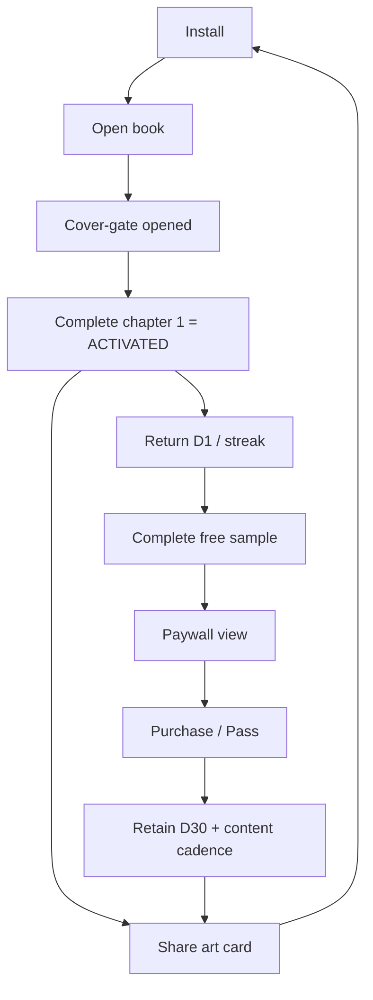

# 🌱 GROWTH STRATEGY — Living Library

> Companion to [`/roadmaps/APP_EXECUTION_ROADMAP.md`](../roadmaps/APP_EXECUTION_ROADMAP.md) · 2026-05-27
> The growth thesis, the loops, the funnel, and the experiments — specific to a **niche, premium, Turkish-language reading app**.

---

## 1. The growth thesis (read this first)

A niche literary app **cannot buy its way to growth** — paid CAC will exceed LTV for a ₺79–₺799 product in a small-TAM, design-led niche. So Living Library must grow on three engines that are *free and structurally available to this product*:

1. **Virality through beauty** — the product is *visually stunning by design*; rendered "art cards" are a share surface mainstream readers don't have.
2. **Organic discovery (ASO)** — a beautiful, well-reviewed, high-retention free app climbs store rankings for genre/literary keywords.
3. **Content cadence** — every new book/chapter is a reactivation event and a new SKU; the catalog *is* the growth engine.

> **The flywheel:** more shared art cards → more installs → more reviews & better ASO → more reads → more revenue → more content → more to share. Everything below feeds this loop.

**What growth is NOT here:** there is no social graph / classic network effect. Don't build feeds, follows, or comments hoping for virality — build *shareable artifacts* and *reasons to return*.

---

## 2. Activation: the cover-gate is a gift

**Definition of activation:** *completed ≥1 chapter in the first session* (not "opened the app"). This is the one number to obsess over first.

The product already owns a rare activation asset: the **cover-gate** — opening a 3D book to enter is a *commitment ritual* (a foot-in-the-door psychological device). Most apps spend heavily to manufacture a "moment"; this one is built in.

**Onboarding rules (Phase 3/5):**
- **Time-to-first-page < 60 seconds. Zero forms. No sign-up.** Pick a book → cover-gate → reading.
- Auto-detect performance mode (already built) — never make the user configure before delight.
- **Defer the notification-permission prompt until after the first chapter-complete** — asking on launch tanks opt-in and D1 (Experiment E7 validates this).
- Suggest a **starter book** matched to the most-tapped cover / a curated default (Experiment E1) rather than a blank shelf.

**Activation experiments:** E1 (starter-book suggestion), E7 (notif timing). See §6.

---

## 3. Retention loops

| Loop | Mechanic | Cadence | Phase |
|---|---|---|---|
| **Resume** | "Continue reading — you're 40% into *X*" hero on shelf | Every open | 2 |
| **Streak** | Daily reading streak (quiet flame + count); streak-save nudge | Daily | 2/5 |
| **Continue-reading nudge** | Local notification when lapsed 1–2 days, evening | On lapse | 5 |
| **New-content drop** | FCM push: "New chapter / new book" | On release | 5/10 |
| **Collection** | Per-book progress rings + "library completion %" | Always visible | 2 |
| **Cliffhanger** | Free sample ends mid-tension | At sample end | 4 |
| **Pass value** | Narration/soundscape exclusives add value to already-read books | Ongoing | 7/10 |

**Habit anchoring:** the dark/atmospheric themes + soundscapes make this a natural **evening wind-down** product. One well-timed nightly nudge (Experiment E4: ~20:30) beats many scattered ones. The goal is a *gentle ritual*, never a guilt machine (guilt is off-brand for a premium product).

**Why each horizon retains:**
- **D1 (≥40%):** instant open + resume + cover-gate ritual + first free chapter delight + (delayed) notif opt-in.
- **D7 (≥20%):** streak established + evening continue-reading nudge + sample cliffhanger curiosity + at least one content drop.
- **D30 (≥10%):** Library Pass value realized (all books + narration + soundscapes) + steady content cadence + the share loop pulling them back.

---

## 4. The virality engine (the #1 acquisition channel)

### 4.1 Art-card sharing — "Share this page"
The core viral mechanic. Render the current page as a **gorgeous, on-brand image**: a selected quote, the book's art direction (palette, typography tokens already exist per book), a subtle wordmark, and a **deep link**. Share to TikTok/IG/X/WhatsApp.

- **Why it works:** screenshots of plain e-reader text are ugly and never shared; a *designed* card is social currency. The product's per-book art direction makes every card distinctive.
- **Rules:** beautiful and on-brand (this is the whole point); **never leak paid content** (share only from samples or short quotes); watermark + deep link on every card.
- **Trigger after delight** — finishing a chapter, a great quote, a long streak — never a nag.

### 4.2 Deep links — open the exact page
A shared card's link opens the **exact book + page** in a free sample, with a clear "install to continue" CTA. Deferred deep linking carries `bookId` + `chapter` + `source` through install → activation. This collapses the gap between "saw a beautiful quote" and "reading it myself."

### 4.3 Referral — "Gift a chapter"
Let a reader **gift a chapter/book unlock** to a friend; reward both sides (e.g., a bonus theme/soundscape). This drives *both* virality and paid unlocks. Avoid spammy mechanics — keep it tasteful (off-brand otherwise). Experiment E5 vs. plain app-link sharing.

### 4.4 Measuring virality
Funnel: `share_create → share_sent → link_click → install → activate → purchase`. Track **share rate per active reader**, **link CTR**, and **K-factor trend**. The goal isn't a one-time spike — it's K-factor *trending upward* as cards and timing improve.

---

## 5. ASO & store presence (organic discovery)

- **The screenshots ARE the marketing.** The product's beauty is the conversion asset — lead with the most atmospheric spreads (per-book art direction, 3D page-turn, themes).
- **Localized listing:** TR primary, EN secondary; keywords across genre terms (mythology, fantasy, cyber-noir, fable) + "premium/atmospheric reading."
- **Reviews are the ASO flywheel input** — seed via the closed-beta cohort; prompt for reviews **after delight** (book complete, long streak), never mid-task.
- **Category & feature graphic** chosen to signal "premium boutique," not "another e-reader."
- **Maintain ≥4.3** — it's a gate on ranking and on install conversion.

---

## 6. Experiment backlog (growth-specific)

> Framework, full table, and guardrails in roadmap §11. Growth-relevant ones expanded here.

| # | Hypothesis | Primary metric | Guardrail | Priority |
|---|---|---|---|---|
| E1 | Suggesting a starter book raises activation | sample-chapter completion (D0) | — | High (cheap, high-leverage) |
| E7 | Notif permission *after* activation > on launch | opt-in rate, D1 | D1 | High |
| E4 | Evening nudge (20:30) > morning for returns | notif→session, D7 | opt-out rate | High |
| E5 | "Gift a chapter" > "share app link" for installs | referral install→activate | — | Med |
| E2 | Cliffhanger paywall at ch.3 > TOC-only lock | paywall_view→purchase | D7 retention | High (revenue) |
| E8 | Single→Pass upsell at 2nd book > 1st | upgrade rate | refund rate | Med |

**Discipline:** ≤2 concurrent experiments early (low traffic → long runtimes); one hypothesis, pre-registered primary metric + guardrails, no peeking; every result (win/loss/inconclusive) logged in a decision journal.

---

## 7. Funnel map (where to focus, in order)

**Optimization order:** fix the *biggest leak first*. Expected sequence of attention:
1. **Install → activation** (open + complete ch.1) — onboarding/starter-book (E1).
2. **Activation → D7** — streak + evening nudge (E4) + delayed opt-in (E7).
3. **Sample → purchase** — cliffhanger paywall (E2).
4. **Reader → share** — art-card prompt timing + card quality (E5).
5. **Purchase → D30/LTV** — Pass value + content cadence + win-back.

---

## 8. The honest constraints

- **Small TAM:** Turkish-language, premium, niche genre. Plan for *quality over volume*; an i18n/EN-content expansion is the lever to grow TAM later (post-PMF).
- **Cold start with no reviews:** seed the closed-beta cohort; lead with beauty in screenshots; lean on art-card virality from day one of public launch.
- **Content cadence is the ceiling:** the single founder/author's throughput caps how fast the catalog (and thus growth + subscription value) expands. Treat author productivity as a first-class growth investment (Phase 10 author co-pilot tooling).
- **Don't fake a social network:** resist feeds/follows. The wins here are *artifacts to share* and *reasons to return*, not a social graph.

---

## 9. North Star & growth dashboard

**North Star:** Weekly Engaged Reading Minutes per Active Reader. (Captures real value; predicts retention + WTP.)

**Weekly growth review tracks:**
- NSM (reading minutes) + Weekly Active Readers completing ≥1 chapter
- Activation rate (install→ch.1-complete)
- D1 / D7 / D30 retention by cohort & by feature exposure (streak vs. not, notif opt-in vs. not)
- Viral: share rate/reader, link CTR, K-factor trend, % organic installs
- ASO: rating, ranking for target keywords, install conversion
- Revenue: free→paid, single→Pass upgrade, ARPU, churn, LTV (cross-referenced with [`MONETIZATION_ANALYSIS.md`](./MONETIZATION_ANALYSIS.md))

**The one-line strategy:** *Be so beautiful that readers share you, so satisfying that they return, and so steadily growing in content that they stay — because you can't afford to buy any of those.*
