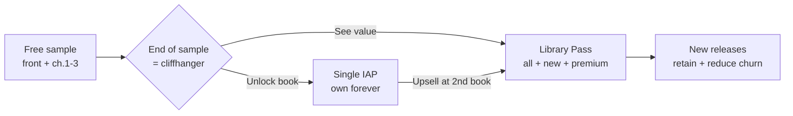

# 💰 MONETIZATION ANALYSIS — Living Library

> Companion to [`/roadmaps/APP_EXECUTION_ROADMAP.md`](../roadmaps/APP_EXECUTION_ROADMAP.md) · 2026-05-27
> The pricing model, the psychology, the unit economics, and the churn math — for a premium, finite-catalog reading app.

---

## 1. The model: hybrid freemium (sample → own → subscribe)

Living Library uses a **three-tier hybrid** that maps perfectly onto the existing engine:

| Tier | What | Price (₺, indicative) | Role |
|---|---|---|---|
| **Free sampler** | Front matter + **first ~3 chapters** of every book | Free | Trust + sunk-curiosity |
| **Single-book unlock** | Full book, **owned forever** (one-time IAP) | ₺79–₺149 | Entry conversion |
| **Library Pass** | All books + premium features + new releases (subscription) | ₺59–₺99/mo · ₺499–₺799/yr | LTV engine |

> **The free tier costs nothing extra to build.** The engine *already eagerly builds front-matter + the first 3 chapters* for instant open. That eager-build region **is** the free sample. Monetization is therefore a matter of *gating chapter 4+*, not building a separate sample. This is a rare, exploitable alignment between architecture and business model.

**Why hybrid (not one or the other):**
- **One-time unlocks** have *zero churn* and suit "I just want this one book" readers — but cap LTV.
- **Subscription** maximizes LTV — but churns hard on a *finite catalog* (binge → cancel).
- The hybrid captures both buyer types and uses the single-unlock as the on-ramp to the Pass ("you bought one — unlock all 6 + new releases for the price of two").

---

## 2. Paywall placement & conversion path



**Placement rules:**
- **Primary paywall = end of the free sample**, rendered *in-world* as a book page at peak curiosity ("The story continues. Unlock *X*."), not a generic modal.
- **Secondary** = locked TOC entries (subtle lock icon → paywall).
- **Tertiary** = premium-feature gates (narration, soundscapes, art-card export → Library Pass).
- **Never** paywall before the first satisfying session; never lose the reader's place across a purchase; resume on the *next* page with an unlock haptic.

**Conversion mechanics:** the sample ends on a cliffhanger (sunk-curiosity), the unlock is one-tap (RevenueCat), and the post-purchase moment is *delightful* (unlock animation + immediate next chapter) to reinforce the buy and seed the Pass upsell.

---

## 3. Pricing psychology

- **Anchor with the annual Pass.** Show annual first ("≈2 months free"), making monthly look like the impulse option and single-unlock the "just this one" option.
- **Ownership beats rental for one-offs.** "Own *Tuzun Hafızası* forever" converts readers who resist subscriptions; the single-unlock honors that instinct.
- **Pass framing = "everything + what's coming."** The value isn't just the current 6 books — it's the *promise of new releases* (which also justifies churn-reducing cadence).
- **Localize to ₺ with fair, round numbers** respecting Turkish purchasing power; use Play's local pricing, not naive USD conversion.
- **Bundle math at the upsell:** "Unlock this **and 5 more** for the price of two" — concrete, legible value.

---

## 4. Willingness-to-pay

| Segment | WTP | Best SKU |
|---|---|---|
| Atmosphere/craft lovers | Medium-high | Single unlock → Pass |
| Collectors ("own beautiful books") | Medium-high, ownership-driven | Single unlocks (multiple) |
| Bingers / genre completists | High *if* catalog is deep | Library Pass (annual) |
| Casual samplers | Low | Stay free; feed virality |

WTP is *raised* by: (a) the demonstrated craft of the free sample (the product sells itself), (b) ownership framing, (c) Pass-exclusive narration/soundscapes that add value even to already-read books.

---

## 5. Unit economics & cost structure

**Costs are dominated by store fees and (optional) AI narration — not infrastructure.**

| Cost | Amount | Notes |
|---|---|---|
| Play/App Store fee | 15% (<$1M/yr tier) → 30% | The largest cost by far |
| RevenueCat | $0 free tier → ~1% MTR | Above the free threshold |
| Infra (Firebase/PostHog/Sentry) | ~$0 → low | Free tiers cover MVP/early Growth |
| Narration (ElevenLabs) | one-time per chapter, **pre-generated** | The only material variable cost — and it's *content-production*, not per-read |

**Illustrative contribution (single unlock at ₺99, 15% store fee):**
```
Gross           ₺99.00
Store fee (15%) -₺14.85
RevenueCat (~1%) -₺0.99
Net             ≈ ₺83.16   (no per-unit infra cost — content is bundled/static)
```
**Key insight:** because content is bundled/static and infra is serverless free-tier, the **marginal cost of an additional sale is ≈ the store fee alone**. Gross margin is structurally high; the constraint is *volume* (niche TAM) and *content supply*, not cost per sale.

---

## 6. Churn analysis (the central monetization risk)

**The risk:** a finite catalog drives subscription churn — a reader binges all 6 books in a month, then cancels. This is *the* monetization threat for the Pass.

**Mitigations (in priority order):**
1. **Content cadence** — every new book/chapter is both a churn-reducer and a reactivation event. Treat author throughput as a monetization investment (Phase 10 co-pilot tooling).
2. **Pass-exclusive value on already-read books** — narration, soundscapes, art-card export. These make the Pass worth keeping even after the catalog is "finished."
3. **Annual plans** — smooth churn, improve cash flow, and pair naturally with the "≈2 months free" anchor.
4. **Collection/streak mechanics** — psychological reasons to stay engaged between drops.
5. **Win-back offers** for cancellers (Experiment); **annual-upgrade nudge** for monthlies near binge-completion.
6. **Hybrid safety valve** — readers who churn the Pass may still *own* single unlocks (zero-churn revenue retained).

**Churn-aware metric to watch:** *post-binge retention* (do subscribers stay past the month they finish the available catalog?). If low, the answer is almost always **more cadence + more Pass-exclusive value**, not a price change.

---

## 7. Conversion & revenue targets

| Metric | MVP/early-Growth target | Notes |
|---|---|---|
| Free → paid (any), 30d | **≥ 8%** | Gate before scaling growth spend |
| Sample-complete → purchase | tune via E2 | Cliffhanger placement is the lever |
| Single → Pass upgrade | establish baseline (E8) | The LTV multiplier |
| Refund rate | **< 3%** | Above this → paywall/expectations mismatch |
| Trial → paid (if trial used, E6) | establish baseline | Watch the churn guardrail |
| Blended ARPU / LTV | grow phase-over-phase | Cross-ref [`GROWTH_STRATEGY.md`](./GROWTH_STRATEGY.md) cohorts |

---

## 8. Pricing & packaging experiments

> Run with PostHog flags; pre-register the primary metric + guardrails (retention, refund, churn). See roadmap §11.

| # | Hypothesis | Primary | Guardrail |
|---|---|---|---|
| E2 | Cliffhanger paywall (ch.3 end) > TOC-only | paywall→purchase | D7 retention |
| E3 | Annual anchored above monthly raises Pass starts | Pass start, ARPU | refund rate |
| E6 | 7-day Pass trial vs. no trial | trial→paid, 60d LTV | churn |
| E8 | Single→Pass upsell at 2nd book vs. 1st | upgrade rate | refund |
| — | Single-book price test (₺79 vs ₺99 vs ₺149) | net revenue/installer | conversion |

**Caution:** never over-optimize the paywall into the retention/trust it depends on. Guardrails are non-negotiable — a paywall change that lifts conversion but tanks D7 is a *loss*.

---

## 9. Compliance & policy (monetization-specific)

- **Digital unlocks MUST use store billing** (Play/Apple) — never a custom processor for in-app digital goods. RevenueCat stays inside policy.
- **Subscription copy must be compliant:** clear price, period, renewal, and cancellation terms; honor store refund/cancellation flows.
- **Entitlements are server-verified** (RevenueCat) — the client never grants access on its own assertion; the device cache is convenience, re-validated on launch/resume.
- **Premium audio delivered via signed URLs** to entitled users only (piracy mitigation for the highest-cost asset).
- **KVKK/GDPR:** purchase data handling disclosed; minimal PII (no accounts needed for purchases in MVP — Play account handles restore).

---

## 10. Revenue scaling levers (in order of leverage)

1. **Content cadence** → more SKUs + lower churn + reactivation. *Highest leverage.*
2. **iOS launch (Phase 8)** → ~2× addressable market, likely higher per-user WTP.
3. **Single → Pass upsell** → multiplies LTV per buyer.
4. **Narration/soundscape tier** → premium upsell + churn reducer.
5. **Gifting/referral** → viral revenue + acquisition in one.
6. **i18n / EN content (post-PMF)** → expands the small TAM — the long-term ceiling-raiser.

**The monetization thesis in one line:** *Convert the cliffhanger to an owned book, convert the owned book to a Pass, and keep the Pass alive with relentless content cadence and Pass-exclusive value — because the catalog's finiteness, not the price, is what threatens revenue.*
