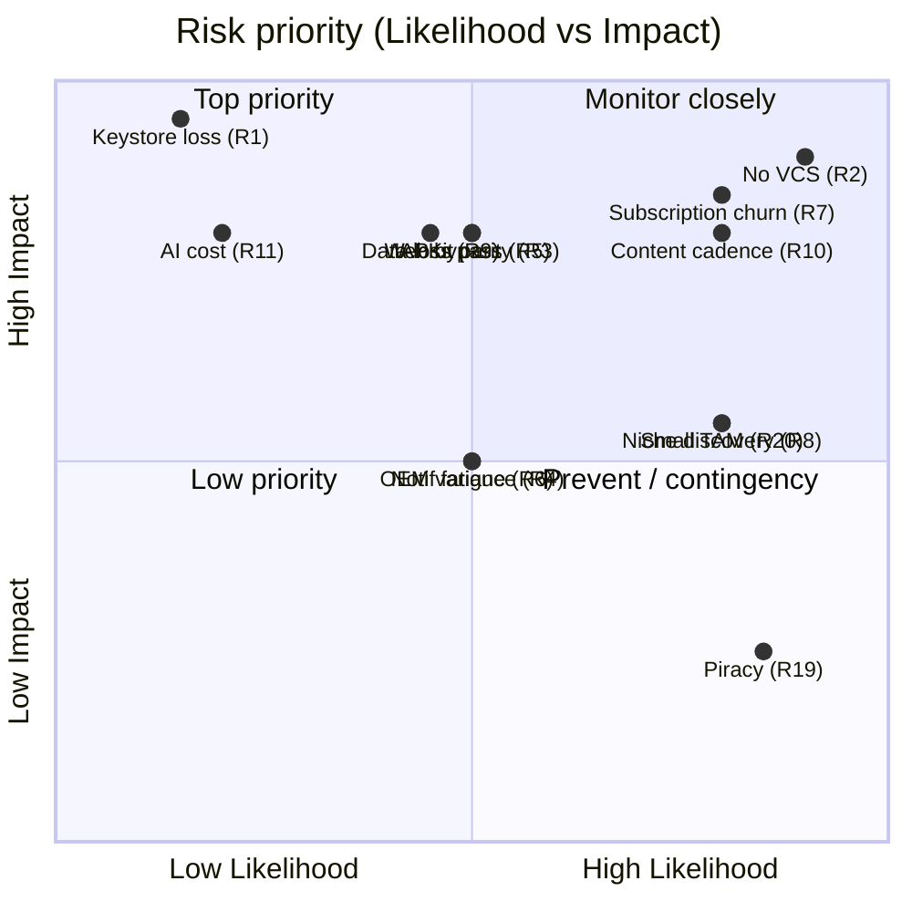

# ⚠️ RISK ANALYSIS — Living Library

> Companion to [`/roadmaps/APP_EXECUTION_ROADMAP.md`](../roadmaps/APP_EXECUTION_ROADMAP.md) · 2026-05-27
> A working risk register: likelihood × impact, the mitigation, the owning phase, and the early-warning signal.

**Scoring:** Likelihood (L) and Impact (I) each Low/Med/High. **Priority = L×I**, with existential/unrecoverable risks flagged 🔴 regardless of likelihood.

---

## 1. Top risks at a glance (the register)

| # | Risk | L | I | Mitigation owner (phase) | Early-warning signal |
|---|---|---|---|---|---|
| R1 🔴 | **Keystore loss** → can never update the app | Low | High | Phase 1: back up keystore in ≥2 secure places + CI secret | n/a (prevent, don't detect) |
| R2 🔴 | **No version control** (project isn't a git repo today) | High | High | Phase 0: `git init` before *any* change | Uncommitted catastrophic edit |
| R3 | **WebKit (iOS) pagination parity** — engine may render differently | Med | High | Phase 8: early, explicit measured parity test on multiple iPhones | Mispacked pages / overflow on iOS TestFlight |
| R4 | **OEM WebView variance** (Android) breaks rendering/behavior | Med | Med | Phase 1/2: test ≥2 OEMs; staged rollout; Sentry+Vitals | Crash/ANR spikes on specific OEMs |
| R5 | **IAP entitlement bypass / fraud** | Med | High | Phase 4: server-verified entitlements (RevenueCat), re-validate on launch | Anomalous unlock-without-purchase events |
| R6 | **Notification fatigue** → uninstalls / 1-stars | Med | Med | Phase 5: ≤3 categories, frequency caps, quiet hours, delayed opt-in | Opt-out spike, uninstall-after-notif |
| R7 | **Subscription churn on finite catalog** | High | High | Phase 7/10: content cadence + Pass exclusives + annual + win-back | Post-binge cancel rate high |
| R8 | **Niche discoverability** / cold start | High | Med | Phase 6: virality engine + ASO; not paid CAC | Flat organic installs |
| R9 | **Progress data loss** (localStorage eviction) | Med | High | Phase 2: migrate to SQLite/Preferences, lossless + fallback | "Lost my place" reviews |
| R10 | **Content cadence ceiling** (single author) | High | High | Phase 10: author co-pilot tooling; cadence as roadmap input | Slowing release frequency |
| R11 | **AI cost runaway** (if narration/AI added naively) | Low | High | Phase 10: pre-generate + cache, never per-read; budget alerts | AI spend per active user rising |
| R12 | **KVKK/GDPR non-compliance** | Med | High | Phase 2/3/9: consent gate, privacy policy, deletion, residency | Regulator/store complaint |
| R13 | **Play/Apple policy violation** (billing, OTA, metadata) | Med | High | Phase 4/10: store-billing only; OTA web-assets only | Store rejection / warning |
| R14 | **Bad OTA update bricks app** | Med | High | Phase 10: staged OTA + auto-rollback; web-only | Crash spike post-OTA |
| R15 | **Accidental engine edit** breaks the moat | Med | High | All phases: `books/**` frozen, CODEOWNERS, single-line hooks only | Engine regression in QA |
| R16 | **App review latency** blocks content drops | High | Low | Phase 10: OTA channel for content (web assets) | Releases queued behind review |
| R17 | **Solo-founder key-person risk** | Med | High | Process: docs/runbooks; selectively bring in help (legal, iOS, design) | Bus-factor of 1 on everything |
| R18 | **Sync conflicts / data loss** (if accounts added) | Med | High | Phase 9: deterministic conflict resolution + tests; keep accounts optional | Lost bookmarks after sync |
| R19 | **Content piracy** (bundled text extractable) | High | Low | Accept for text; protect audio (signed) + watermark cards | Reposted text (low-value niche) |
| R20 | **Small TAM** caps revenue ceiling | High | Med | Post-PMF: i18n / EN content to expand TAM | Revenue plateaus despite good metrics |

---

## 2. Technical risks (detail)

**R1 🔴 Keystore loss.** Losing the Android signing keystore means you can **never publish an update** to the same app listing — an unrecoverable, business-ending event. *Mitigation:* generate once in Phase 1, back up to ≥2 secure locations (password manager + offline), store as a CI secret, document recovery. This is *prevention only* — there is no detection.

**R2 🔴 No version control.** The project is **not currently a git repository** (confirmed at setup). Any edit risks irreversible loss, and you can't safely refactor the engine boundary without history. *Mitigation:* Phase 0 mandates `git init` + private remote + `.gitignore` **before any other change**.

**R3 WebKit pagination parity.** The engine's measurement-based paginator (`scrollHeight` vs. frame height + binary search) was tuned on Chromium WebView. WKWebView (iOS) has subtly different layout/measurement behavior. The roadmap's "no rewrite" promise is *strongest on Android*; iOS is where it's tested. *Mitigation:* Phase 8 treats parity as an **explicit, early, measured test** on multiple iPhone sizes — not an assumption. *Contingency:* small WebKit-specific CSS/measurement shims in the bridge (Zone B), never an engine rewrite.

**R4 OEM WebView variance.** Android WebView versions/skins differ across Samsung/Xiaomi/etc. *Mitigation:* test ≥2 physical OEM devices (Phase 1), staged rollout (Phase 3), Sentry (JS) + Crashlytics + Android Vitals (native) watching OEM breakdowns.

**R9 Progress data loss.** WebView `localStorage` can be evicted under storage pressure → silent loss of reading position → furious reviews. *Mitigation:* Phase 2 migrates to SQLite/Preferences, lossless + idempotent, with localStorage fallback for one release.

**R14 Bad OTA update.** A live-update channel can push a broken build to everyone at once. *Mitigation:* web-assets-only OTA, **staged rollout + automatic rollback** on crash-rate threshold (Phase 10); prove rollback with a deliberately-broken test update.

**R15 Accidental engine edit.** A careless refactor "improving" the engine could break the moat. *Mitigation:* `books/**` marked FROZEN (README/CODEOWNERS); the *only* permitted edits are single-line `emit`/`isUnlocked` hooks; engine regression checks in QA.

---

## 3. Product risks (detail)

**R6 Notification fatigue.** Over-notifying is a top uninstall/1-star driver. *Mitigation:* ≤3 categories (continue-reading, new-release, streak-save), frequency caps, quiet hours, easy opt-out, and the permission prompt **deferred until after activation** (Experiment E7). Tune cadence via Remote Config without releases.

**R7 Subscription churn (finite catalog).** *The* central monetization risk — bingers cancel after finishing 6 books. *Mitigation (layered):* content cadence (the real fix) + Pass-exclusive narration/soundscapes (value on already-read books) + annual plans + collection/streak mechanics + win-back offers. *Watch:* post-binge retention. See [`MONETIZATION_ANALYSIS.md`](./MONETIZATION_ANALYSIS.md) §6.

**R18 Sync conflicts.** If accounts/sync land (Phase 9), naive merge can lose bookmarks/corrupt progress. *Mitigation:* deterministic conflict resolution (last-write-wins on progress, union on bookmarks), two-device convergence tests, and **keep accounts optional** so the offline-first core is never at risk.

---

## 4. Growth risks (detail)

**R8 Niche discoverability / cold start.** A small-TAM literary app has no cheap paid-acquisition path. *Mitigation:* lean entirely on the virality engine (art-card sharing + deep links + referral, Phase 6) and ASO (beautiful screenshots + reviews), not paid CAC. *Watch:* organic-install share and K-factor trend. See [`GROWTH_STRATEGY.md`](./GROWTH_STRATEGY.md).

**R10 Content cadence ceiling.** Growth and subscription value are capped by one author's output. *Mitigation:* treat author throughput as a first-class investment; build author co-pilot tooling (Phase 10); plan release cadence as a roadmap input. *This is arguably the #1 long-term constraint — more than any infra concern.*

**R16 App-review latency.** Store review delays content drops (which are reactivation events). *Mitigation:* OTA channel for *web-asset* content (Phase 10) ships new books without queuing behind native review.

**R20 Small TAM.** Even with great metrics, Turkish-language premium niche has a revenue ceiling. *Mitigation (post-PMF):* internationalization + EN content to expand TAM — the long-term ceiling-raiser. Don't over-invest in TAM expansion *before* PMF in the core niche.

---

## 5. Security & compliance risks (detail)

**R5 Entitlement bypass / IAP fraud.** Client-side gating is inherently bypassable. *Mitigation:* RevenueCat **server-verified** entitlements are the source of truth; the device cache is convenience, re-validated on launch/resume; premium audio behind signed URLs to entitled users; App Check on the webhook function; verify webhook signatures.

**R12 KVKK/GDPR.** Turkey's KVKK (+ GDPR for EU users) governs analytics, notifications, and any PII. *Mitigation:* consent gate before analytics init (Phase 2), privacy policy + Terms (TR+EN), data-deletion path (mandatory once accounts exist, Phase 9), PostHog EU residency option, accurate Play Data Safety form, documented lawful basis. The MVP's **no-accounts/minimal-PII** posture is a deliberate compliance *advantage*.

**R13 Store policy violations.** Two specific traps: (a) using a **custom payment processor** for digital unlocks (forbidden — must use store billing), and (b) OTA-updating **native code** (forbidden — only web assets may update OTA). *Mitigation:* RevenueCat stays within billing policy; OTA is strictly web-asset content; subscription/metadata copy reviewed against policy before submission.

**R19 Content piracy.** Bundled book text is extractable. *Mitigation:* **accept** the risk for niche TR text (low pirate value, high friction to monetize stolen text), but protect the *highest-cost* asset — premium **audio** — via signed delivery, and watermark share cards. Don't waste effort DRM-ing low-value text.

**WebView hardening.** Restrict the WebView to the local/`capacitor://` scheme, strict CSP (self + Google Fonts only), no remote code execution, pinned allowed navigation — closing the usual hybrid attack surface.

---

## 6. Business / process risks (detail)

**R17 Solo-founder key-person risk.** One person currently holds all engineering, content, design, and ops context (bus-factor = 1). *Mitigation:* write runbooks (release, incident, billing) even if the only reader is the founder; selectively bring in help where it's cheapest and highest-leverage — **legal** (privacy/subscription copy), **iOS/Mac access** (Phase 8), **design assets** (mostly already exist). Document the incident-response severity levels and "who's paged" even if it's one name.

---

## 7. Risk heat map (priority view)

---

## 8. The five risks that actually matter

If you ignore everything else, get these right:

1. **R2 — Initialize Git before touching anything.** (Phase 0; trivial to fix, catastrophic to skip.)
2. **R1 — Back up the keystore.** (Phase 1; unrecoverable if lost.)
3. **R7 + R10 — Feed the catalog.** Content cadence simultaneously defeats subscription churn *and* the growth ceiling. It is the most important *ongoing* investment.
4. **R5 — Server-verify entitlements.** Don't trust the client for money.
5. **R3 — Measure WebKit parity early.** It's the one place the "no rewrite" thesis is genuinely tested; find out in Phase 8, not after an iOS launch.

Everything else is bounded and well-mitigated by the phase plan. The product's biggest risks are **not** infrastructure or engineering scale (those are trivially handled by static + serverless) — they are **content supply, distribution, and getting paid securely**, which is exactly what the roadmap sequences around.
