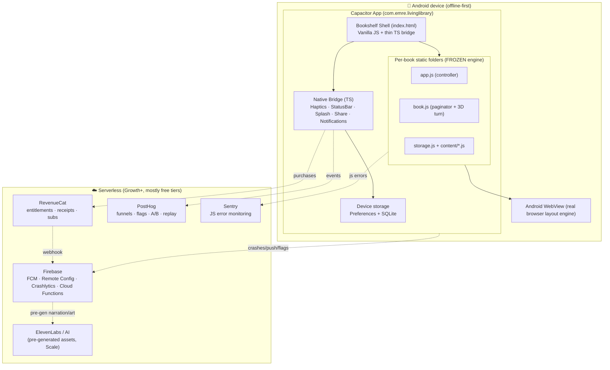
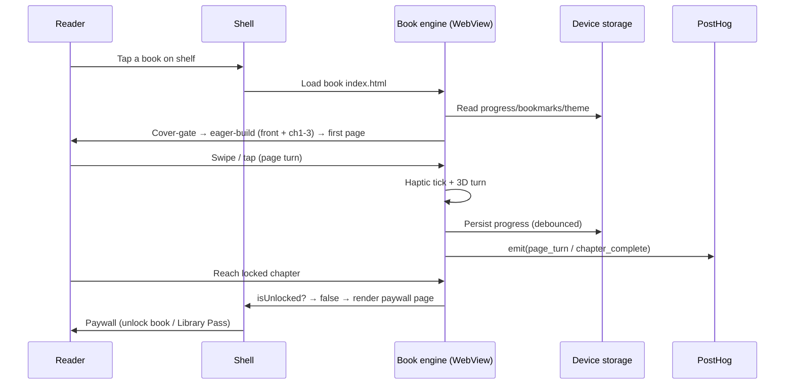
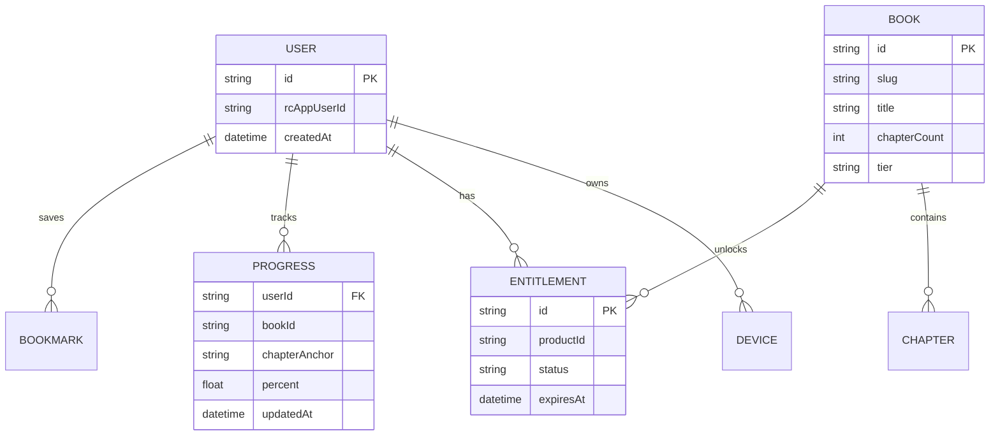
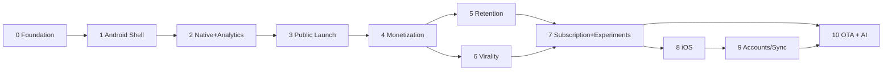

# 📘 LIVING LIBRARY — APP EXECUTION ROADMAP

> **Product:** Living Library — a premium, offline-first mobile reading catalog
> **App ID:** `com.emre.livinglibrary`
> **Platform strategy:** Capacitor WebView hybrid · **Android-first**, iOS later
> **Generated:** 2026-05-27 · **Roadmap engine:** AI Agent App Roadmap Generation System V2
> **Source of truth:** `startup_idea_template.md` (architecture report) + this roadmap
> **Companion reports:** [`/reports/TECH_DECISIONS.md`](../reports/TECH_DECISIONS.md) · [`/reports/GROWTH_STRATEGY.md`](../reports/GROWTH_STRATEGY.md) · [`/reports/MONETIZATION_ANALYSIS.md`](../reports/MONETIZATION_ANALYSIS.md) · [`/reports/RISK_ANALYSIS.md`](../reports/RISK_ANALYSIS.md)

---

## ⚡ EXECUTIVE PRE-FLIGHT (read this first)

This roadmap does **not** start from zero. There is already a **production-quality crown jewel**: a hand-built, zero-dependency vanilla-JS reading engine (measurement-based paginator, 3D page-turn, themes, bookmarks, per-book art direction) with **~265,000 words of finished content across 6 books**. The single most consequential engineering decision — *do not rewrite the engine* — has already been validated in the source analysis.

Therefore this roadmap optimizes a different objective than a normal "idea → app" plan:

> **Convert an existing best-in-class reading *artifact* into a distributable, monetizable, retention-driven *product* — without degrading the artifact.**

The real bottleneck is **not infrastructure** (a static, offline-first app has near-zero burn). It is three things, in order: **(1) distribution** (getting into the Play Store and discovered), **(2) monetization plumbing** (chapter locks via IAP, which do not exist yet), and **(3) content cadence** (a finite 6-book catalog must keep growing to sustain a subscription). The phases below are sequenced around exactly those bottlenecks.

---

# 1. STARTUP OVERVIEW

**One-sentence description:** Living Library is a premium, offline-first mobile app that delivers a curated catalog of atmospheric, art-directed Turkish books through a hand-crafted reading engine no mainstream e-reader can match — monetized through chapter unlocks and a "Library Pass" subscription.

**Target users**
- **Primary:** Turkish-language readers of literary & genre fiction (cyber-noir, fantasy, mythology, fables), ~16–40, mobile-first, who value *atmosphere, craft, and design* over catalog breadth. They already abandon Kindle/Wattpad because those feel utilitarian or ad-cluttered.
- **Secondary (distribution engine):** design-conscious readers who screenshot and share aesthetic "quote cards" on TikTok/Instagram/X — the viral surface.
- **Internal (supply side):** the author/creator (Emre) — the content engine whose throughput is the true scaling constraint.

**Use cases**
- Immersive evening/commute reading of a premium title, fully offline.
- "Collecting" beautifully art-directed books like objects, not just consuming text.
- Sampling a book free, hitting a cliffhanger, and unlocking the rest.
- Sharing a gorgeous rendered page as social content.
- Listening (narration mode) during commute / hands-busy moments.

**Core value proposition:** *"Books that feel like artifacts."* A reading experience — bespoke typography, per-book themes, soundscapes, cinematic 3D page-turns, offline-first — that Kindle, Apple Books, and Wattpad structurally cannot offer because they optimize for a neutral, universal container. Living Library optimizes for *art direction per title*.

**Competitive positioning:** Not an e-bookstore competing on breadth. A **boutique digital press as an app** competing on *craft, atmosphere, and ownership*. Think "A24 / Criterion Collection, for books."

**Market category:** Premium digital reading / interactive fiction / indie mobile publishing.

**Monetization strategy (decisive recommendation):** **Freemium funnel → Library Pass subscription.**
- **Free:** a generous sampler of every book (the engine already eagerly builds front-matter + **first 3 chapters** — that *is* the free tier, for free).
- **Paid (entry):** one-time IAP to unlock a full book (own-it-forever framing).
- **Paid (LTV):** **Library Pass** subscription — all books + premium features (narration, soundscapes, art-card export) + new releases.
- **Rails:** RevenueCat over Google Play Billing (cross-platform-ready for iOS). See [`/reports/MONETIZATION_ANALYSIS.md`](../reports/MONETIZATION_ANALYSIS.md).

**North Star Metric:** **Weekly Engaged Reading Minutes per Active Reader.** It captures delivered value (immersive reading actually happening), predicts retention, and correlates with willingness to pay better than installs or DAU. Secondary "constellation": Weekly Active Readers completing ≥1 chapter.

**MVP success metrics (gates to proceed)**
| Metric | MVP target | Why it gates |
|---|---|---|
| Crash-free sessions | ≥ 99.5% | WebView/engine stability across OEMs is the existential technical risk |
| Open-a-book rate (of installers) | ≥ 70% | Validates the bookshelf → reader funnel |
| Sample-chapter completion | ≥ 30% | Validates that the *reading experience* lands |
| D1 / D7 retention (of book-openers) | ≥ 40% / ≥ 20% | Validates habit potential before spending on growth |
| Play Store rating | ≥ 4.3 | Gates organic discoverability (ASO) |
| Free → paid (30d, growth phase) | ≥ 8% | Validates monetization before scaling spend |

---

# 2. PRODUCT-MARKET ANALYSIS

**User pain points**
- Mainstream e-readers feel *sterile* — no atmosphere, identical typography for every book, no sense of place.
- Wattpad-style apps are free but ad-heavy, low-craft, and socially noisy.
- Turkish-language premium digital fiction is underserved; quality indie/genre Turkish work has no beautiful home.
- Readers who love a book have no satisfying way to *share its aesthetic* (screenshots of plain text are ugly).

**Existing alternatives & their weaknesses**
| Alternative | Strength | Weakness Living Library exploits |
|---|---|---|
| Amazon Kindle | Catalog, sync, ecosystem | Utilitarian, zero art direction, generic feel |
| Apple Books | Clean, native | Neutral container, no per-book identity |
| Wattpad | Free, social, huge UGC | Ads, low craft, cluttered, "cheap" feel |
| Storytel / Audible | Audio catalog | Audio-only, no visual craft, subscription fatigue |
| Generic EPUB readers | Free, flexible | No design, no monetization story for the author |

**Market opportunities**
- A *curated, art-directed* niche is defensible precisely because it does **not** scale like a marketplace — incumbents won't bother art-directing per title.
- Turkish genre fiction (mythology, fantasy, cyber-noir) has a passionate, underserved mobile audience.
- The "aesthetic share card" is an organic acquisition channel mainstream readers structurally lack.

**Differentiation opportunities**
1. **Per-book art direction** (themes, palettes, status-bar/splash theming) — already built.
2. **Cinematic reading engine** (measurement-based pagination, 3D page-turn) — already built, hard to replicate.
3. **Atmospheric layer** (soundscapes, haptics) — native superpowers unlocked by Capacitor.
4. **Offline-first ownership** — buy it, own it, read it anywhere with no network.
5. **Shareable rendered pages** — turns readers into a distribution channel.

**Behavioral-psychology opportunities**
- **Ritual:** the existing "cover-gate" (opening a 3D book to enter) is a *commitment device* — lean into it for activation.
- **Collection instinct:** "owning" beautiful books → completion/collection mechanics.
- **Variable reward + streaks:** reading streaks and new-chapter drops.
- **Sunk-curiosity at the paywall:** the free sample ends on a cliffhanger.

**AI leverage opportunities** (deliberately *optional* — the core app is **not** AI-dependent, which keeps burn near-zero)
- Premium **narration** via high-quality TTS (ElevenLabs), pre-generated & cached per chapter.
- **AI-generated share cards** (style-consistent imagery per book).
- **Semantic codex search** (embeddings over the lore/bestiary modules — Mendîran/Mythologica already have structured data).
- **Author co-pilot tooling** to raise content cadence (the real bottleneck).

**Network-effect potential:** Weak-but-real. No classic multiplayer network effect, but a **content + virality flywheel**: more shared art cards → more installs → more reviews → better ASO → more reads → more revenue → more content → more to share. Plan for *this* flywheel, not a social graph.

---

# 3. RECOMMENDED TECH STACK

> Full reasoning & rejected alternatives in [`/reports/TECH_DECISIONS.md`](../reports/TECH_DECISIONS.md). Summary below.

**Guiding principle:** *Preserve the crown jewel ("Motor LOCK"). Add capability around it, never inside it.* New code (shell, native bridge, monetization) may use modern tooling; the **reading engine stays vanilla and untouched**.

| Layer | Technology | Why | Tradeoff / future implication |
|---|---|---|---|
| **Reading engine** | Existing Vanilla JS (ES6 IIFE) — **frozen** | It is the moat; depends on a real browser layout engine; rewriting = max risk | No framework safety net; mitigated by Sentry + freeze discipline |
| **Native shell** | **Capacitor 6** | Wraps the engine verbatim, ships to both stores, mature plugin ecosystem | Slight native build/signing learning curve (one-time) |
| **Bookshelf home / new UI** | Vanilla JS + CSS, **optionally** a thin Vite+TS workspace for *new* code only | Keeps zero-build ethos for books; type safety for native-bridge code | Two "modes" (no-build books + built shell) — bounded by clear directory rules |
| **Native bridge code** | TypeScript (compiled into `www/` shared layer) | Type-safe plugin calls, fewer runtime errors in WebView | Adds a build step *only* for `shared/` and `index.html` shell |
| **Billing / IAP** | **RevenueCat** over Google Play Billing | Handles receipt validation, entitlements, subscriptions, cross-platform; saves weeks | Vendor dependency; ~1% fee above store cut (worth it for indie) |
| **Backend (Growth+)** | **Firebase** (Cloud Functions, FCM, Remote Config, Crashlytics) | Mobile-native services in one SDK; serverless; generous free tier | Some lock-in; Cloud Functions cold starts (irrelevant at this scale) |
| **Optional relational sync** | Supabase (Postgres) *if/when* accounts+sync needed | Open-source, relational, RLS | Defer until Scale; Firebase covers MVP/Growth |
| **User-data storage (device)** | localStorage → **Capacitor Preferences** (small) + **@capacitor-community/sqlite** (bookmarks/progress) | Robust, offline-first, survives WebView cache eviction | Migration step required from existing localStorage |
| **Content storage** | **Bundled in app** (offline-first); OTA via live-update (Scale) | Zero network reads, instant open, no CDN cost | App size grows with catalog; mitigated by OTA/asset packs |
| **CI/CD** | **GitHub Actions + Fastlane** → Play tracks (internal→closed→prod) | Reproducible signed `.aab`, automated track promotion | iOS needs macOS runner later (Codemagic / GH macOS) |
| **Product analytics + experiments** | **PostHog** (cloud or self-host) | Funnels, retention, feature flags, **A/B**, session replay — one tool | WebView event hygiene needed; EU data residency option |
| **JS error monitoring** | **Sentry** (browser SDK in WebView) | Catches engine/JS errors the native crash reporter misses | Source-map upload step in CI |
| **Mobile crash & vitals** | **Firebase Crashlytics** + Google Play **Android Vitals** | Native crashes, ANRs, OEM breakdowns | Two error tools (Sentry=JS, Crashlytics=native) — intentional |
| **Push notifications** | **FCM** | Free, native, reliable on Android | iOS APNs config later (RevenueCat/Firebase handle) |
| **Local notifications** | **@capacitor/local-notifications** | Streaks / "continue reading" without a server | Scheduling/permission UX care needed |
| **Share / deep links** | **@capacitor/share** + Android App Links | Art-card virality + open-to-exact-page | Domain verification for App Links |
| **Narration (Scale)** | Native TTS (free) → **ElevenLabs** pre-generated (premium) | Free tier covers accessibility; premium = paid feature | ElevenLabs cost controlled by pre-generate + cache (never live) |

**Core MVP plugin set:** `@capacitor/core`, `@capacitor/android`, `@capacitor/haptics`, `@capacitor/status-bar`, `@capacitor/splash-screen`, `@capacitor/preferences`, `@capacitor/app`.
**Growth additions:** `@revenuecat/purchases-capacitor`, `@capacitor/local-notifications`, `@capacitor-firebase/messaging`, `@capacitor-firebase/crashlytics`, `@capacitor/share`, `@capacitor-community/sqlite`.

---

# 4. SYSTEM ARCHITECTURE

### 4.1 High-level architecture (Mermaid)



### 4.2 Frontend architecture
- **Two zones, one app.** **Zone A = frozen book engine** (no build, no deps, per-book namespace `window.SARMASIK` etc.). **Zone B = shell + bridge** (bookshelf home, paywall UI, onboarding, settings, native integration) — may use TS + a thin Vite build that emits into `www/`.
- **Contract between zones:** the shell launches a book by navigating the WebView to the book's `index.html`; the book reports lifecycle events (open, page-turn, chapter-complete, bookmark) by calling a tiny global bridge `window.LL.emit(event, payload)` that the shell/bridge layer defines. This is the *only* new line touching book code — a single instrumentation hook.
- **Entitlement gating:** the bridge exposes `window.LL.isUnlocked(bookId, chapterIndex)`; `book.js`'s lazy chapter builder asks it before splicing a locked chapter, rendering a paywall page instead. Minimal, surgical change to one method.

### 4.3 Backend architecture
- **MVP: none.** 100% client-side, offline. (This is a feature, not a gap — privacy + zero cost.)
- **Growth: serverless only.** Firebase Cloud Functions handle exactly two server jobs: (a) RevenueCat webhook → Crashlytics/analytics + (optional) audit log; (b) signed delivery of premium pre-generated assets (narration audio) for entitled users. No long-running services, no DB to operate for MVP.
- **Scale: optional accounts + sync** (Firebase Auth + Firestore *or* Supabase) for cross-device progress.

### 4.4 Infra topology
- **MVP:** Play Store CDN delivers the `.aab`; everything else is on-device. There is no server to scale.
- **Growth:** RevenueCat (SaaS) + Firebase (serverless) + PostHog/Sentry (SaaS). All horizontally managed.
- **Scale:** add an **OTA content channel** (Capgo / self-hosted live-update / Appflow) so new books and engine fixes ship **without a store review**, plus a CDN bucket for premium audio.

### 4.5 Data flow (read session)


### 4.6 Authentication & purchase flow (Mermaid)
```mermaid
sequenceDiagram
    participant U as Reader
    participant App as App (RevenueCat SDK)
    participant Play as Google Play Billing
    participant RC as RevenueCat
    participant FB as Firebase Fn (webhook)
    U->>App: Tap "Unlock" / "Library Pass"
    App->>Play: launchBillingFlow(product)
    Play-->>App: Purchase token
    App->>RC: SDK posts receipt
    RC->>Play: Server-side verify
    RC-->>App: Entitlement = active
    RC->>FB: Webhook (purchase event)
    App->>App: window.LL.setEntitlements() → unlock chapters
    Note over U,App: No account required for MVP.<br/>Entitlement cached on device; restore via Play account.
```

### 4.7 Event system, async processing, caching
- **Events:** single `window.LL.emit()` → fan-out to PostHog (product), Sentry (errors), local persistence. Defined once in the bridge; book code only emits.
- **Async:** the engine's existing `requestIdleCallback` lazy pagination stays as-is. New async work (analytics flush, purchase restore, asset prefetch) runs off the critical path on idle.
- **Caching:** content is bundled (ultimate cache). Premium audio is downloaded once and cached on device. Remote Config flags cached with TTL. No server-side cache needed at this scale.

### 4.8 Analytics pipeline
`Book/Shell events → window.LL.emit() → PostHog (autocapture off, explicit events) → dashboards (funnels, retention, A/B) ` and `Crashes → Crashlytics`, `JS errors → Sentry`, `Revenue → RevenueCat → PostHog (via export) for LTV/cohort`. See §11 for experiments.

---

# 5. DATA MODEL DESIGN

> The app is **local-first**; most "data" lives on-device. Cloud entities appear only in Growth/Scale.

### 5.1 On-device entities (MVP)
| Entity | Key fields | Store |
|---|---|---|
| `ReadingProgress` | `bookId`, `chapterAnchor`, `pageIndex`, `percent`, `updatedAt` | SQLite |
| `Bookmark` ("İz") | `id`, `bookId`, `chapterAnchor`, `label`, `createdAt` | SQLite |
| `Preferences` | `theme`, `readerScale`, `perfMode (lite/rich)`, `firstSeen` | Preferences |
| `Entitlement` (cached) | `bookId | library_pass`, `active`, `source`, `checkedAt` | Preferences (cache of RevenueCat truth) |
| `Streak` | `currentStreak`, `longestStreak`, `lastReadDate` | Preferences |

### 5.2 Cloud entities (Growth/Scale — only if accounts added)


### 5.3 Scaling, indexing, multi-tenant, security
- **Scaling concern:** *content volume*, not user rows. A 93K-word book bundled as JS is fine; at ~20+ books, move large titles to **on-demand asset packs / OTA** to keep install size sane (Play recommends staying well under 150 MB base; use Play Asset Delivery or live-update).
- **Indexing (cloud, if added):** index `progress(userId, bookId)`, `entitlement(userId, productId)`, `bookmark(userId, bookId, createdAt)`.
- **Multi-tenant:** trivial — a single creator's catalog; "tenant" = user. If a future **author CMS / marketplace** emerges, introduce `publisherId` then.
- **Security:** entitlements' source of truth is **RevenueCat (server-verified)**, never the device cache — the device cache is a UX convenience and is re-validated on launch + on resume. Bookmarks/progress are non-sensitive. Minimal PII (no accounts in MVP) is a deliberate privacy advantage. See §9.

---

# 6. GROWTH & RETENTION STRATEGY

> Full playbook in [`/reports/GROWTH_STRATEGY.md`](../reports/GROWTH_STRATEGY.md). Core loops below.

**Onboarding psychology** — The app already has a *ritual* asset most apps pay dearly to fake: the **cover-gate** (opening a 3D book). Use it. Onboarding rule: **time-to-first-page < 60s, zero forms.** No sign-up, no tutorial wall. Pick a book → cover-gate → reading. Auto-detect performance mode (already built). Defer the notification-permission ask until *after* the first satisfying session (post first chapter-complete), not on launch.

**Activation definition:** *completed ≥1 chapter in the first session* (not "opened app"). Instrument and optimize this single number first.

**Retention loops**
| Loop | Mechanic | Trigger |
|---|---|---|
| Continue-reading | "You're 40% into *Tuzun Hafızası*" | Local notification, evening, if lapsed 1–2 days |
| Reading streak | Daily streak counter + gentle flame | On open; nudge before streak breaks |
| New content | "New chapter / new book just landed" | FCM push on release |
| Collection | Progress rings per book; "library completion %" | Visible on shelf |
| Cliffhanger pull | Free sample ends mid-tension → paywall | End of sample chapter |

**Habit formation:** anchor reading to **evening wind-down** (the atmospheric/dark themes + soundscapes reinforce a bedtime ritual). One well-timed daily nudge beats many.

**Gamification (gentle, on-brand):** streaks + collection completion + "first to finish a new drop" — never points/leaderboards (off-brand for a premium literary product).

**Referral / shareability (the primary acquisition engine):** **"Share this page as an art card"** — render the current page (quote + book art + subtle wordmark + deep link) to an image for TikTok/IG/X. Plus **"gift a chapter"** referral. This is the one channel a niche literary app can win, because the product is *visually beautiful by design*.

**Notification strategy:** ≤ 3 categories (continue-reading, new-release, streak-save), all opt-in, all locally relevant, frequency-capped. Respect quiet hours.

**Streak & progression systems:** streak persisted on-device (works offline); progression = chapters read, books completed, library % — surfaced on the shelf as quiet, elegant progress, not arcade UI.

**Social proof:** review prompts fired *after delight* (finishing a book, a long streak day); show aggregate reader counts on the shelf once meaningful.

**Retention targets**
| Horizon | Strategy | Target (book-openers) |
|---|---|---|
| **D1** | Cover-gate ritual + instant open + resume + first free chapter + delayed notif opt-in | ≥ 40% |
| **D7** | Streak + continue-reading notif + sample cliffhanger curiosity + ≥1 content drop | ≥ 20% |
| **D30** | Library Pass value (all books + narration + soundscapes) + content cadence + share loop | ≥ 10% |

**Viral loop opportunities:** art-card share → recipient taps deep link → opens that exact page in a free sample → installs to continue → shares. **Referral:** gift-a-chapter unlock to a friend; both sides get a small reward (e.g., a bonus theme).

---

# 7. MONETIZATION STRATEGY

> Full model, pricing tables, and sensitivity analysis in [`/reports/MONETIZATION_ANALYSIS.md`](../reports/MONETIZATION_ANALYSIS.md).

**Pricing model (hybrid freemium):**
1. **Free sampler** — front matter + first ~3 chapters of every book (the engine builds these eagerly *for free*, so this tier costs nothing extra to ship).
2. **Single-book unlock (IAP, one-time)** — *own it forever*. Entry price point; converts the cliffhanger.
3. **Library Pass (subscription, monthly + annual)** — all books + premium features (narration, soundscapes, art-card export, new releases). The LTV engine.

**Indicative pricing (Turkish market; tune via experiment):**
| SKU | Price (₺, indicative) | Framing |
|---|---|---|
| Single-book unlock | ₺79–₺149 | "Own *Tuzun Hafızası* forever" |
| Library Pass — monthly | ₺59–₺99 / mo | "Everything + new releases" |
| Library Pass — annual | ₺499–₺799 / yr | Anchor: "≈2 months free" |

**Conversion strategy:** free sample → **cliffhanger paywall** at peak curiosity → single unlock (low friction) → upsell to Library Pass ("unlock this **and 5 more** for the price of two"). Paywall also surfaces in TOC on locked chapters and on premium-only features (narration).

**Free → paid upgrade path:** generous sample (build trust + sunk curiosity) → single purchase (commitment) → subscription (habit + catalog value). Never gate the *first* satisfying session.

**Pricing psychology:** anchor with annual Library Pass (best value framing); single unlock as the "I just want this one" option (ownership beats rental for one-off readers); local ₺ pricing respecting purchasing power; round, "fair" numbers.

**Willingness-to-pay:** moderate-but-real among atmosphere/collector readers; raised by (a) the demonstrated craft of the free sample, (b) ownership framing, (c) premium narration/soundscape exclusives.

**Churn risks & mitigation:** a **finite catalog** is the #1 subscription churn driver (binge → cancel). Mitigate with: steady content cadence, narration/soundscape exclusives that add value to *already-read* books, streak/collection mechanics, and annual plans that smooth churn. One-time unlocks have *zero* churn but cap LTV — hence the hybrid.

**Paywall placement:** end-of-sample (primary), locked TOC entries (secondary), premium-feature gates (tertiary). Never mid-sentence; never before first delight.

**Revenue scaling levers:** content cadence → more SKUs; subscription mix → higher LTV; iOS launch → ~2× addressable; narration tier → upsell; gifting → viral revenue.

---

# 8. AI & INFRASTRUCTURE COST ANALYSIS

**Headline:** This is a **near-zero-burn** product by design. Offline-first + static content + serverless + free tiers means infra cost is **dominated by store fees and (optional) AI narration**, not servers.

| Cost center | MVP | Growth | Scale | Notes |
|---|---|---|---|---|
| Hosting/compute | **$0** | ~$0 (Firebase free tier) | low (Functions + storage) | No servers to run |
| Play Store fee | 15–30% of revenue | same | same | 15% under $1M/yr (Play 15% tier) |
| RevenueCat | $0 (<$2.5K MTR free) | ~1% MTR above threshold | ~1% MTR | Worth it vs. building receipt validation |
| Analytics (PostHog) | $0 (1M events free) | low | medium | Keep events lean (no autocapture) |
| Error (Sentry/Crashlytics) | $0 | $0–low | low | Crashlytics free; Sentry free tier |
| Push (FCM) | $0 | $0 | $0 | Free |
| **AI narration (ElevenLabs)** | $0 (not in MVP) | variable | **main variable cost** | **Pre-generate + cache; never live** |
| Vector DB (semantic search) | $0 | $0 | low | Optional; pgvector/Supabase if added |
| Bandwidth/storage | $0 | low | medium | Premium audio only; books are bundled |

**AI cost discipline (critical):** if/when narration ships, **pre-generate audio per chapter once**, store as static assets, and serve cached — *never* call a TTS/LLM API at read time per user. This converts a per-read variable cost into a one-time content-production cost. Same rule for AI art cards: generate templates/styles offline; compose on-device.

**Cost bottlenecks & optimization:**
- **Biggest "cost" is review latency & content throughput, not dollars.** Mitigate with OTA content channel (Scale) so releases don't queue behind store review.
- **Install size** grows with catalog — move large titles to asset packs / OTA at ~10+ books.
- **Caching opportunities:** bundle everything; cache audio + Remote Config; debounce analytics.
- **Async opportunities:** pre-generate AI assets in CI/offline; prefetch next-book audio on Wi-Fi only.

---

# 9. SECURITY & COMPLIANCE ANALYSIS

| Risk | Exposure here | Mitigation |
|---|---|---|
| **Auth risk** | Minimal — **no accounts in MVP** | Add Firebase Auth only when sync needed; use platform identity (Play) for restore |
| **IAP abuse / unlock spoofing** | Real — client-side gating is bypassable | **Server-verified entitlements via RevenueCat**; device cache is convenience only, re-validated on launch/resume; sensitive premium *audio* delivered via signed URLs to entitled users only |
| **API abuse** | Low (few endpoints) | Cloud Functions behind App Check; rate-limit webhooks; verify RevenueCat webhook signature |
| **Data privacy** | Low PII surface (no accounts) | Minimal-data posture; clear Play **Data Safety** form; on-device-only by default |
| **GDPR / KVKK** | Turkey = **KVKK**; EU users = GDPR | Privacy policy (TR+EN), consent for analytics, data-deletion path, PostHog EU residency option, document lawful basis; no selling data |
| **Payment risk** | Must use **Play Billing** for digital goods (policy) | Never use a custom payment processor for in-app digital unlocks; RevenueCat stays within policy |
| **Prompt injection / AI misuse** | **N/A for MVP** (no live LLM) | When AI added: pre-generate offline, no user-text → model at runtime, sanitize any user input to author tools |
| **Multi-tenant leakage** | Low (single catalog) | If accounts/sync: enforce per-user RLS (Supabase) or security rules (Firebase) |
| **WebView security** | Loads only bundled local assets | Restrict to `capacitor://`/local scheme; strict CSP; no remote code execution; pin allowed navigation |
| **Content piracy** | Bundled text is extractable | Accept for text (low-value to pirate niche TR fiction); protect *premium audio* via signed delivery; watermark share cards |

**Compliance checklist before public launch:** Privacy Policy + Terms (TR primary, EN secondary) · Play Data Safety form accurate · KVKK/GDPR consent for analytics & notifications · age rating · refund/subscription-cancellation copy compliant with Play policy · accessibility statement (TTS, reduced-motion already supported).

---

# 10. PHASE PLAN

**Legend:** 📍 MVP = ship a stable, instrumented free app · 🚀 GROWTH = monetize + retain + virality · 🏗️ SCALE = iOS, sync, OTA, catalog & AI.

Each phase is **independently deployable** and ends with a real artifact in users' hands or testers' hands.

---

## 📍 MVP PHASES

### 📍 Phase 0 — Foundation & Consolidation

### SUB-PR Breakdown

*SUB-PRs 0.1–0.4 split Phase 0 with no overlap; completing all four equals 100% of Phase 0.*

#### SUB-PR 0.1 — Version Control & Project Scaffolding

**Objective:** Establish a reproducible, version-controlled project shell before any asset is touched.

**Deliverables:** Initialized Git repo pushed to private GitHub; `.gitignore` (node_modules, /android, build artifacts); `package.json`; empty `www/` + `www/shared/` + `www/books/` skeleton; reserved `window.LL` namespace marker.

**Tasks:**
- `git init`, add `.gitignore`, commit the empty scaffold, and push to a private GitHub repo.
- Create `package.json` and the `www/`, `www/shared/`, `www/books/` directory skeleton.
- Reserve the `window.LL` namespace marker for later phases (no logic yet).

**Validation:** Repo exists on GitHub with an initial commit; `www/` skeleton present; `.gitignore` excludes build artifacts.

#### SUB-PR 0.2 — Frozen-Engine Content Consolidation

**Objective:** Copy all 6 books verbatim into the served tree without altering a single engine or content file.

**Deliverables:** `www/books/<slug>/` for all 6 titles (sarmasik, tuzun-hafizasi, mendiran-vakayinamesi, mythologica, solgun-kitabe, fabl) copied as-is.

**Tasks:**
- Copy the 6 books verbatim into `www/books/` using the correct slugs, preserving the Turkish dotted-İ path behavior.
- Confirm each book's relative asset paths resolve under a served root.
- Add a "frozen / Motor LOCK" README marker in each book folder to prevent accidental edits.

**Validation:** All 6 book folders present with original files byte-for-byte unchanged; no engine/content file modified.

#### SUB-PR 0.3 — Bookshelf Entry Point & Local Serve Workflow

**Objective:** Provide a single entry point linking to every book plus a documented way to serve it locally.

**Deliverables:** `www/index.html` bookshelf placeholder linking to each `books/<slug>/index.html`; documented local serve workflow.

**Tasks:**
- Create `www/index.html` (vanilla HTML/CSS/JS, zero dependencies) listing/linking all 6 books.
- Document the serve command (`python3 -m http.server 8080` or `npx serve www`).

**Validation:** Serving `www/` exposes the bookshelf and every link opens the correct book's `index.html`.

#### SUB-PR 0.4 — Smoke Verification, Checklist & Docs

**Objective:** Prove every book fully functions from the consolidated served root and document the run.

**Deliverables:** Per-book pass/fail smoke table; `RUN.md` with exact serve & verify commands; final consolidated commit.

**Tasks:**
- Manually verify each book: open, cover-gate, paginate, page-turn, TOC, theme switch, font scale, bookmark, reload-resume.
- Record a per-book pass/fail table; report real on-disk slug names if any differ from the plan.
- Write `RUN.md` and commit the verified consolidated tree.

**Validation:** All 6 books pass the smoke checklist over local serve; `RUN.md` reproduces the run.

**Objective:** Produce one clean, locally-served `www/` "Living Library" web project that contains the bookshelf shell + all 6 books (engines frozen), verified to open every book.

**Business Goal:** De-risk everything downstream by establishing a single, reproducible source tree — the substrate for store distribution and monetization.

**Dependencies:** None (greenfield consolidation of existing assets).

**Deliverables:**
- `www/` with `index.html` (bookshelf), `books/<slug>/` for all 6 titles (engine + content copied verbatim), optional `shared/` for later dedupe.
- A documented local serve workflow; a smoke checklist confirming all 6 books open and paginate.
- `package.json`, `.gitignore`, a Git repo initialized (currently **not** a repo — fix this in step 1).

**Tech Decisions:** Keep books as static folders (no build). Introduce *only* a minimal workspace config now; the Vite/TS shell build comes in Phase 1 if needed. **Initialize Git** — the project is not yet version-controlled, which is a critical risk for a one-person team.

**Growth Assumptions:** None yet (pre-instrumentation).

**Monetization Assumptions:** None yet.

**Tasks:**
#### Frontend
- Create `www/index.html` bookshelf placeholder linking to each `books/<slug>/index.html`.
- Copy the 6 books verbatim into `www/books/` using the correct slugs (mind the Turkish dotted-İ path issue noted in the source doc).
- Confirm relative asset paths resolve under a served root.
#### Backend
- None.
#### Infrastructure
- `git init`; commit the consolidated tree; push to a private GitHub repo. Add `.gitignore` (node_modules, /android, build artifacts).
- Document `python3 -m http.server 8080` (or `npx serve www`) verification.
#### Analytics
- None yet (Phase 2 adds instrumentation) — but reserve `window.LL` namespace now.
#### Testing
- Manual smoke test: every book opens, cover-gate works, pagination + page-turn + themes + bookmarks function over local serve.
- Document a per-book checklist (open, turn, TOC, theme, font scale, bookmark, reload-resume).
#### Growth Systems
- None.

**Critical Considerations:** Do **not** modify engine internals. Preserve the Turkish-İ slug behavior. Get under version control *before* any further change. Verify `file://` vs served behavior (some books may rely on served paths).

**Success Metrics:** All 6 books open & paginate from a single served root; repo initialized; reproducible local run documented.

**Risk Analysis:** *Technical* — hidden absolute paths or CORS/`file://` assumptions break under consolidation. *Process* — editing engine files by accident (mitigate with a CODEOWNERS/"frozen" README in each book folder).

**Execution Prompt (FOR AI AGENT):**
> **Role:** You are a build-consolidation engineer. **Goal:** Assemble a single served `www/` project containing a bookshelf `index.html` plus the 6 existing books copied verbatim, then verify every book opens.
> **Folder structure (create exactly):**
> ```
> digital-book-app/
> ├─ www/
> │  ├─ index.html            # bookshelf placeholder (list/links to each book)
> │  ├─ shared/               # empty for now (future dedupe)
> │  └─ books/
> │     ├─ sarmasik/          # = intikam-yemini, copied as-is
> │     ├─ tuzun-hafizasi/
> │     ├─ mendiran-vakayinamesi/
> │     ├─ mythologica/       # = mythology-digital-book
> │     ├─ solgun-kitabe/
> │     └─ fabl/
> ├─ package.json
> └─ .gitignore
> ```
> **Constraints:** Treat every file under `www/books/**` as **READ-ONLY / FROZEN** ("Motor LOCK"). Do not edit, reformat, or "improve" engine or content files. Only create the new `index.html` and project scaffolding.
> **Coding standards:** `index.html` must be vanilla HTML/CSS/JS, zero dependencies, matching the books' aesthetic restraint.
> **Validation (must perform & report):** Serve `www/` on :8080; for each of the 6 books confirm it loads, the cover-gate opens, pages paginate, a page-turn animates, a theme switch works, and reload resumes progress. Output a pass/fail table. **Anti-hallucination:** Do not claim a book works without actually loading its `index.html`; if a path/slug differs from the table, report the real on-disk name rather than inventing one. **Deliverable:** the structure above + a `RUN.md` with the exact serve & verify commands + the pass/fail table. Initialize Git and commit.

---

### 📍 Phase 1 — Capacitor Android Shell + Bookshelf Home

### SUB-PR Breakdown

*SUB-PRs 1.1–1.4 split Phase 1 with no overlap; completing all four equals 100% of Phase 1.*

#### SUB-PR 1.1 — Capacitor Project & TS/Vite Shell Scaffolding

**Objective:** Stand up the Capacitor Android project and the thin TypeScript/Vite build for shell + bridge, leaving books frozen.

**Deliverables:** `capacitor.config.ts` (appId `com.emre.livinglibrary`, `webDir 'www'`); generated, committed `android/`; `src-shell/` Vite+TS workspace emitting into `www/`.

**Tasks:**
- `npx cap init`, `npm i @capacitor/core @capacitor/android`, `npx cap add android`, `npx cap sync`.
- Create `src-shell/` (TS strict, ESLint+Prettier) with a Vite build that outputs into `www/` without touching `books/**`.

**Validation:** `npx cap doctor` clean; the shell build emits into `www/`; `books/**` unchanged.

#### SUB-PR 1.2 — Bookshelf Home UI & `window.LL` Bridge Stub

**Objective:** Build the real bookshelf home and the final-signature bridge stub.

**Deliverables:** Polished bookshelf `index.html` (cover grid, per-book title/tagline, theme-accurate styling, "Continue reading" hero slot); `src-shell/ll-bridge.ts` (`emit`, `isUnlocked`→`true`, `openBook`); per-book splash/status-bar color metadata table.

**Tasks:**
- Implement the bookshelf UI (covers, taglines, theme-accurate styling, continue-reading hero slot).
- Implement the `window.LL` bridge stub with final signatures (`isUnlocked` returns `true` for now).
- Add the per-book splash/status-bar color metadata table in the shell.

**Validation:** Shelf renders all 6 books with art; bridge stub callable; visual restraint matches the books (no Material defaults).

#### SUB-PR 1.3 — Signing, Build Pipeline, Sentry & Play Internal Testing

**Objective:** Produce a signed artifact, wire early error monitoring, and get it onto Play Internal Testing.

**Deliverables:** Release keystore (securely backed up) + documented signing; Gradle configured for a signed `.aab`; Sentry browser SDK in the shell; Play Console app + listing draft + Internal Testing release.

**Tasks:**
- Create and securely back up (≥2 locations) the release keystore; configure Gradle for a signed `.aab`.
- Wire the Sentry browser SDK into the shell (local scheme + strict CSP allowing only Google Fonts + self).
- Create the Play Console app, draft the listing, and upload to Internal Testing.

**Validation:** Signed `.aab` builds; Internal Testing release is actually live (real upload confirmation); Sentry receives a test JS error.

#### SUB-PR 1.4 — Device-Matrix Testing & Validation

**Objective:** Verify stable, offline-capable behavior across OEMs and document it.

**Deliverables:** `BUILD.md` with the device matrix, `cap doctor`/Gradle output, and signing/backup steps.

**Tasks:**
- Run on emulator + ≥2 physical OEM devices; verify all 6 books open inside the shell.
- Verify offline launch (airplane mode), Android back-button (book→shelf, not exit), and deep navigation.
- Check the low-end / `lite` perf-mode path; record the device matrix in `BUILD.md`.

**Validation:** Crash-free manual run on ≥2 OEMs; offline launch and back-button correct; device-matrix table complete.

**Objective:** Wrap `www/` in a Capacitor Android app and ship a runnable build to the Play **Internal Testing** track, with a real bookshelf home screen.

**Business Goal:** Existence of a distributable Android artifact — the precondition for *every* downstream business outcome.

**Dependencies:** Phase 0.

**Deliverables:** Capacitor project (`@capacitor/core`, `@capacitor/android`); a polished bookshelf `index.html` (covers, per-book entry, "continue reading" slot); a signed `.aab`; an Internal Testing release; the `window.LL` bridge stub.

**Tech Decisions:** Capacitor 6, `webDir=www`, appId `com.emre.livinglibrary`. Introduce a **thin Vite+TS build for the shell + bridge only** (emit into `www/`), leaving `books/**` untouched. Create a keystore now and store it securely (and in CI secrets later).

**Growth Assumptions:** A beautiful shelf increases book-open rate vs. a bare link list; "continue reading" placement drives return-session depth.

**Monetization Assumptions:** None yet (free, all unlocked) — but design the shelf so a "locked/owned" state can be added without redesign.

**Tasks:**
#### Frontend
- Build the bookshelf: cover art grid, per-book title/tagline, theme-accurate styling, "Continue reading" hero slot (reads progress in Phase 2).
- Implement `window.LL` bridge stub (`emit`, `isUnlocked` returning `true` for now, navigation helpers).
- Per-book splash/status-bar color metadata table in the shell.
#### Backend
- None.
#### Infrastructure
- `npx cap init`, `npm i @capacitor/android`, `npx cap add android`, `npx cap sync`.
- Create release keystore; document signing; configure Gradle for `.aab`.
- Create Play Console app; complete store listing draft; upload to **Internal Testing**.
#### Analytics
- Wire **Sentry** browser SDK into the shell (catch JS errors early, even pre-product-analytics).
#### Testing
- Run on emulator + at least **2 real physical devices** (different OEMs / Android versions) — OEM WebView variance is the key risk.
- Verify offline launch (airplane mode after install), back-button behavior, deep navigation, and that all 6 books open inside the shell.
#### Growth Systems
- None yet (shelf is the foundation for them).

**Critical Considerations:** Android **back button** must navigate book→shelf, not exit. Handle WebView storage persistence (don't let the OS evict progress — Phase 2 migrates to SQLite). Test on low-end devices (the `lite` perf mode path). Keystore loss = cannot update the app ever — back it up in ≥2 secure locations.

**Success Metrics:** App installs & launches offline on test devices; all 6 books open; crash-free in manual testing; Internal Testing release live; ≥2 OEMs verified.

**Risk Analysis:** *Technical* — WebView rendering differences across OEMs; signing/Gradle friction. *Distribution* — Play Console setup/policy declarations. *Process* — keystore mishandling (existential).

**Execution Prompt (FOR AI AGENT):**
> **Role:** Capacitor mobile engineer. **Goal:** Turn `www/` into a runnable, internally-distributable Android app with a real bookshelf home.
> **Folder structure additions:**
> ```
> digital-book-app/
> ├─ capacitor.config.ts        # appId com.emre.livinglibrary, webDir 'www'
> ├─ android/                   # generated; commit it
> ├─ src-shell/                 # NEW: TS source for shell + bridge (Vite → emits into www/)
> │  ├─ ll-bridge.ts            # window.LL: emit(), isUnlocked(), openBook()
> │  └─ shelf.ts
> └─ www/index.html             # bookshelf (consumes built shell assets)
> ```
> **Architecture constraints:** `books/**` remain FROZEN. New code is TypeScript, strict mode. The shell build must output into `www/` without altering book folders. `window.LL.isUnlocked()` returns `true` for all (no monetization yet) but the signature is final.
> **Coding standards:** TS strict; no `any`; ESLint+Prettier on `src-shell/` only. Match the books' visual restraint — no generic Material defaults on the shelf.
> **Security:** WebView restricted to local scheme; strict CSP allowing only Google Fonts + self; no remote script.
> **Deployment requirements:** Produce a signed `.aab`; document keystore creation and **backup**; create an Internal Testing track release. Provide a `BUILD.md`.
> **Performance expectations:** Cold start to shelf < 2s on a mid-range device; book open to first page < 1.5s (engine already optimized).
> **Testing requirements:** Verify on emulator + 2 physical OEM devices; offline launch; back-button shelf navigation; all 6 books open. **Anti-hallucination:** Do not report a Play track as live unless the upload actually succeeded; paste the real `cap doctor` and Gradle output. **Validation:** crash-free manual run + the device matrix table in `BUILD.md`.

---

### 📍 Phase 2 — Native Polish, Persistence & Instrumentation

### SUB-PR Breakdown

*SUB-PRs 2.1–2.4 split Phase 2 with no overlap; completing all four equals 100% of Phase 2.*

#### SUB-PR 2.1 — Native Feel: Haptics & Per-Book Theming

**Objective:** Make the app feel native via haptics and per-book chrome, with safe browser fallbacks.

**Deliverables:** `src-shell/native.ts`; haptic page-turn + firmer bookmark/chapter-complete pulse; per-book splash + status-bar theming.

**Tasks:**
- Add `tick()` haptic in next/prev handlers and a firmer pulse on bookmark/chapter-complete (silent degrade if the plugin is absent).
- Apply per-book splash screen + status-bar color matching each book's `theme-color`.
- Feature-detect and `try/catch` all native calls so the same code runs in a desktop browser.

**Validation:** Haptics fire on device and no-op cleanly in browser; status-bar/splash match the active book; `prefers-reduced-motion` respected.

#### SUB-PR 2.2 — Durable Persistence, Migration, Progress & Streak Data

**Objective:** Move user data into durable storage losslessly and surface reading progress + the streak counter.

**Deliverables:** `src-shell/storage.ts`, `src-shell/streak.ts`; localStorage→SQLite/Preferences migration; shelf progress surfacing; offline streak counter.

**Tasks:**
- Implement SQLite (`@capacitor-community/sqlite`) + Preferences storage and a one-time localStorage→SQLite migration (keep localStorage as fallback for one release).
- Surface progress on the shelf ("Continue reading", per-book %).
- Add the persisted, offline streak data model (counter only, surfaced minimally).

**Validation:** Migration is lossless and idempotent against seeded fixtures; progress + streak persist across restarts; no progress-loss path.

#### SUB-PR 2.3 — Instrumentation: Analytics Taxonomy, Crash & Error Monitoring

**Objective:** Make behavior measurable through one typed event hook, plus crash/error monitoring.

**Deliverables:** `src-shell/analytics.ts` (PostHog wrapper + consent gate); typed `LLEvent` taxonomy via `window.LL.emit`; Firebase Crashlytics + Android Vitals; Sentry source-maps in CI; PostHog dashboards.

**Tasks:**
- Define the typed event taxonomy (`app_open`, `shelf_view`, `book_open`, `cover_gate_opened`, `page_turn`, `chapter_complete`, `book_complete`, `bookmark_add`, `theme_change`, `font_scale_change`, `session_end` with `reading_minutes`, `error`) and add the sanctioned single-line `emit` hooks in `goNext/goPrev/bookmark/chapterComplete`.
- Add Firebase (Android) Crashlytics, configure Android Vitals, and a CI Sentry source-map upload step.
- Build PostHog dashboards: activation funnel (install→open→ch1-complete), retention curves, reading-minutes (NSM).

**Validation:** Events arrive in PostHog live; Crashlytics + Sentry capture a forced test crash; the `emit` hooks are the only `books/**` change.

#### SUB-PR 2.4 — Verification, QA & Compliance Hardening

**Objective:** Prove durability, performance, and privacy compliance of the new layer.

**Deliverables:** Migration test report; event-fires-once verification; consent gate + Data Safety mapping.

**Tasks:**
- Unit-test the migration (lossless + idempotent) with seeded fixtures; verify each taxonomy event fires exactly once per action.
- Verify the analytics consent gate blocks init until granted; confirm no PII in payloads; document the Data Safety mapping.
- Confirm instrumentation adds < 1ms to a page turn and is batched off the critical path.

**Validation:** ≥99.5% crash-free in testing; migration test passes; consent gate enforced; per-page-turn overhead within budget.

**Objective:** Make it *feel* native (haptics, splash/status-bar theming), make user data *durable* (SQLite migration), and make behavior *measurable* (PostHog + Crashlytics + Sentry).

**Business Goal:** Convert a "wrapped website" into a credible premium app and gain the measurement needed to make every later decision data-driven.

**Dependencies:** Phase 1.

**Deliverables:** Haptic page-turn/bookmark; per-book status-bar + splash theming; localStorage→SQLite/Preferences migration; full analytics taxonomy emitting through `window.LL.emit`; Crashlytics + Android Vitals; Sentry source maps in CI.

**Tech Decisions:** `@capacitor/haptics`, `@capacitor/status-bar`, `@capacitor/splash-screen`, `@capacitor/preferences`, `@capacitor-community/sqlite`, `@capacitor-firebase/crashlytics`, PostHog JS. One-line instrumentation hooks in book controllers (the *only* sanctioned engine touch — a single `window.LL.emit(...)` call in `goNext/goPrev/bookmark/chapterComplete`).

**Growth Assumptions:** Haptics + theming materially raise perceived quality → ratings & retention. Durable storage prevents the silent killer of "lost my progress" 1-star reviews.

**Monetization Assumptions:** Clean activation/funnel data is the prerequisite to set the paywall in Phase 4 where curiosity peaks.

**Tasks:**
#### Frontend
- Add `tick()` haptic in next/prev handlers; firmer pulse on bookmark/chapter-complete (degrade silently if plugin absent — works in browser dev).
- Per-book splash screen + status-bar color matching `theme-color`.
- Surface progress on the shelf ("Continue reading", per-book %).
#### Backend
- None (Crashlytics/PostHog are SaaS ingest).
#### Infrastructure
- Add Firebase project (Android app) for Crashlytics; configure Android Vitals monitoring in Play Console.
- CI step: upload Sentry source maps on each build.
#### Analytics
- Define the **event taxonomy** (see below) and route all through `window.LL.emit`.
- Core events: `app_open`, `shelf_view`, `book_open`, `cover_gate_opened`, `page_turn`, `chapter_complete`, `book_complete`, `bookmark_add`, `theme_change`, `font_scale_change`, `session_end (with reading_minutes)`, `error`.
- Build PostHog dashboards: activation funnel (install→open→ch1-complete), retention curves, reading-minutes (NSM).
#### Testing
- Migration test: existing localStorage progress survives upgrade to SQLite (write a one-time migration + test with seeded data).
- Verify haptics on device; verify analytics events arrive; verify Crashlytics catches a forced test crash.
#### Growth Systems
- Streak data model (persisted, offline) — counter only, surfaced minimally on shelf (notifications come in Phase 5).

**Critical Considerations:** **Privacy** — explicit, lean events only (no autocapture, no PII); consent gate for analytics per KVKK/GDPR. **Migration safety** — never lose a reader's progress; keep localStorage as fallback for one release. **Performance** — analytics must not block the read loop (fire-and-forget, batched). Respect `prefers-reduced-motion` for haptics intensity.

**Success Metrics:** ≥99.5% crash-free sessions; activation funnel visible; NSM (reading minutes) measurable; zero progress-loss reports in testing; haptics/theming verified on devices.

**Risk Analysis:** *Technical* — SQLite plugin platform quirks; migration data loss. *Product* — over-instrumenting hurts perf. *Compliance* — analytics without consent violates KVKK/GDPR.

**Execution Prompt (FOR AI AGENT):**
> **Role:** Mobile platform + analytics engineer. **Goal:** Add native feel, durable storage, and a clean measurement layer — touching book engine code in exactly one sanctioned way (emit hooks).
> **Architecture constraints:** The *only* permitted edit inside `books/**` is adding `window.LL?.emit('event', payload)` calls (and one `window.LL?.isUnlocked()` check reserved for Phase 4) inside existing handlers — no logic changes, no refactors. All other logic lives in `src-shell/`.
> **Folder additions:** `src-shell/analytics.ts` (PostHog wrapper + consent gate), `src-shell/storage.ts` (SQLite + Preferences + localStorage migration), `src-shell/native.ts` (haptics/status-bar/splash), `src-shell/streak.ts`.
> **Coding standards:** TS strict; all native calls wrapped in `try/catch` and feature-detected so the same code runs in a desktop browser for dev. Events typed via a `LLEvent` union — no stringly-typed event names at call sites.
> **Testing requirements:** Unit-test the localStorage→SQLite migration with seeded fixtures (must be lossless and idempotent); integration-test that each taxonomy event fires once per action; force a test crash and confirm Crashlytics + Sentry capture. **Security:** consent gate before any analytics init; no PII in payloads; document the Data Safety mapping.
> **Performance expectations:** Instrumentation adds < 1ms to a page turn; analytics batched & off the critical path. **Anti-hallucination:** Do not mark an event "working" without showing it arriving in PostHog live events; paste the migration test output. **Validation:** crash-free device run + funnel dashboard screenshot + migration test report.

---

### 📍 Phase 3 — Closed Beta & Public Play Store Launch (Free)

### SUB-PR Breakdown

*SUB-PRs 3.1–3.4 split Phase 3 with no overlap; completing all four equals 100% of Phase 3.*

#### SUB-PR 3.1 — Launch-Readiness Polish & First-Run Experience

**Objective:** Make the build itself launch-ready and the first session friction-free.

**Deliverables:** Polished empty/error/offline states; finalized cover art + store screenshots; first-run flow with delayed notification opt-in.

**Tasks:**
- Polish empty/error/offline states across the shell and reader.
- Finalize cover art and store screenshots that showcase the art direction.
- Implement the first-run experience (pick-a-book → cover-gate → reading); defer the notification opt-in until after first delight.

**Validation:** First run reaches a reading page in < 60s with no forms and no launch-time notification prompt; states render correctly.

#### SUB-PR 3.2 — Store Presence, ASO, Legal & Compliance

**Objective:** Make the app publishable and policy-compliant on Google Play.

**Deliverables:** ASO assets (TR+EN); hosted Privacy Policy + Terms; Data Safety form; content rating.

**Tasks:**
- Author ASO: title, short/long description (TR primary, EN secondary), keywords, category, feature graphic.
- Host Privacy Policy + Terms; complete the Data Safety form and content rating questionnaire.

**Validation:** Listing complete and policy declarations accurate; Data Safety matches the actual (lean) event set.

#### SUB-PR 3.3 — Remote Config, Growth Hooks & Baseline Analytics

**Objective:** Stand up runtime config, the first growth surfaces, and the locked baseline dashboard.

**Deliverables:** Firebase Remote Config flags (`streak_enabled`, `paywall_enabled` default off); reading streaks enabled; review-prompt-after-delight; baseline dashboard.

**Tasks:**
- Wire Remote Config flags (`streak_enabled` on, `paywall_enabled` off) so features flip without a release.
- Enable reading streaks and a review prompt fired after delight (book complete / long streak).
- Lock the baseline dashboard (install→open→activation, D1/D7/D30 cohorts, reading-minutes NSM, crash-free %, store rating) with release-marker annotations.

**Validation:** Flags toggle behavior remotely; baseline dashboard populated and annotated with the release marker.

#### SUB-PR 3.4 — Closed Beta, Staged Rollout & Launch Validation

**Objective:** Ship safely to production and confirm baseline quality with real users.

**Deliverables:** Closed beta (50–500 testers) + seeded reviews; staged production rollout; `RELEASE.md` rollout log + baseline numbers.

**Tasks:**
- Run the closed beta and seed initial reviews via the cohort; run the Play pre-launch report (device matrix).
- Do an accessibility pass (native TTS, reduced-motion) and TR localization QA.
- Execute the staged rollout (10% → 50% → 100%) watching Android Vitals + Crashlytics; record `RELEASE.md`.

**Validation:** Public on Play with real crash-free % ≥ 99.5% and rating ≥ 4.3; rollout paused/continued per real Vitals (reported truthfully).

**Objective:** Ship the free app publicly on Google Play and establish **baseline retention/quality metrics** with real users.

**Business Goal:** Real distribution + a measured baseline. You cannot optimize monetization (Phase 4) without a real D1/D7 and activation baseline.

**Dependencies:** Phase 2.

**Deliverables:** Closed beta (50–500 testers) → production release (free, all books readable as generous samples + full for now, *or* full-free to maximize reviews — decide via the monetization report); complete store listing (screenshots showcasing the art direction), ASO, privacy policy, Data Safety.

**Tech Decisions:** Promote through Play tracks (internal→closed→production). Use Remote Config (Firebase) so you can flip features without a release. Keep monetization OFF (free) to maximize installs, reviews, and retention truth before introducing friction.

**Growth Assumptions:** A free, beautiful, well-reviewed app seeds ASO and a review base — the foundation for organic discovery of a niche literary product.

**Monetization Assumptions:** Deliberately none yet — *measure first*. (Some teams launch paid immediately; here the source doc's virality strategy + niche argue for a free, review-seeding launch.)

**Tasks:**
#### Frontend
- Polish empty/error/offline states; finalize cover art & store screenshots (the product's beauty IS the marketing).
- First-run experience: pick-a-book → cover-gate → reading; **delayed** notification opt-in.
#### Backend
- Firebase Remote Config flags (e.g., `streak_enabled`, future `paywall_enabled`).
#### Infrastructure
- ASO: title, short/long description (TR primary, EN secondary), keywords, category, feature graphic.
- Privacy policy + Terms hosted; Data Safety form; content rating questionnaire.
- Staged rollout (e.g., 10% → 50% → 100%) with Android Vitals + Crashlytics watch.
#### Analytics
- Lock the **baseline** dashboard: install→open→activation, D1/D7/D30 cohorts, reading minutes (NSM), crash-free %, store rating.
- Funnel annotations for release markers.
#### Testing
- Pre-launch report in Play Console (automated device matrix); accessibility pass (TTS via native, reduced-motion already supported); localization QA (TR strings).
#### Growth Systems
- Enable reading **streaks**; review-prompt after delight (book complete / long streak).
- Seed initial reviews via the closed-beta cohort.

**Critical Considerations:** Staged rollout to catch OEM crashes before full exposure. Don't ask for notification permission on launch. Ensure the *free experience is genuinely satisfying* (it's the trust you'll later convert). Watch ANRs on low-end devices.

**Success Metrics:** Public on Play; ≥99.5% crash-free; ≥4.3 rating; activation ≥30% (sample-chapter completion); D1 ≥40%, D7 ≥20% (book-openers); a clean baseline for Phase 4.

**Risk Analysis:** *Product* — niche discoverability; cold-start with no reviews. *Technical* — OEM-specific crashes surfacing at scale. *Growth* — low organic install volume (addressed by Phase 6 virality).

**Execution Prompt (FOR AI AGENT):**
> **Role:** Release manager + ASO specialist. **Goal:** Take the instrumented free app to public production on Google Play with a baseline metrics dashboard and a staged, safe rollout.
> **Tasks:** Finalize listing assets (TR+EN), Data Safety, content rating, privacy policy links; configure staged rollout; wire Remote Config flags `streak_enabled`/`paywall_enabled`(default off); enable review-prompt-after-delight; lock the baseline analytics dashboard.
> **Constraints:** Monetization stays OFF this phase. No notification prompt on first launch. **Validation:** show the Play "production" status, the staged-rollout %s, the pre-launch report device results, and the baseline dashboard. **Anti-hallucination:** report the *actual* crash-free % and rating from Play, not targets; if rollout is paused due to a Vitals threshold, say so. **Deliverable:** `RELEASE.md` with the rollout log + baseline numbers.

---

## 🚀 GROWTH PHASES

### 🚀 Phase 4 — Monetization Foundation (Chapter Locks via IAP)

### SUB-PR Breakdown

*SUB-PRs 4.1–4.4 split Phase 4 with no overlap; completing all four equals 100% of Phase 4.*

#### SUB-PR 4.1 — Billing Rails: RevenueCat, Play Products & Entitlement Cache

**Objective:** Establish server-verified billing infrastructure and product configuration.

**Deliverables:** `src-shell/billing.ts` (RevenueCat over Play Billing); single-book SKUs in Play + RevenueCat; device entitlement cache; App Check + CI secrets.

**Tasks:**
- Integrate `@revenuecat/purchases-capacitor`; configure single-book products/entitlements in Play Console + RevenueCat.
- Implement the device entitlement cache (Preferences) re-validated on launch/resume (RevenueCat is source of truth).
- Add App Check and store secrets in CI.

**Validation:** SDK fetches offerings; entitlement state reads from RevenueCat and re-validates on resume; secrets are not committed.

#### SUB-PR 4.2 — Entitlement Gating & Cliffhanger Paywall

**Objective:** Lock chapters at the engine's lazy boundary and present the in-world paywall.

**Deliverables:** `window.LL.isUnlocked(bookId, chapterIndex)`; the single sanctioned `book.js` gate; `src-shell/paywall.ts`; locked-TOC affordance.

**Tasks:**
- Implement `window.LL.isUnlocked()` reading the entitlement cache; have `book.js`'s lazy builder consult it before splicing a locked chapter and render a paywall page object instead.
- Build the paywall rendered *as a book page* at the sample boundary ("The story continues. Unlock *X*.").
- Show locked chapters in the TOC with a subtle lock that taps through to the paywall.

**Validation:** Locked chapters render the in-world paywall; the only `books/**` change is the `isUnlocked` consult; never paywalls before first delight.

#### SUB-PR 4.3 — Purchase/Restore Flows, Webhook Backend & Funnel

**Objective:** Execute purchases end-to-end with server reconciliation and measurement.

**Deliverables:** Purchase + Restore Purchases flows; `functions/revenuecatWebhook.ts`; conversion funnel; post-purchase delight.

**Tasks:**
- Implement purchase + Restore Purchases flows that return the reader seamlessly to the next page with an unlock haptic.
- Build the Firebase Cloud Function RevenueCat webhook (verify signature, record purchase, fire analytics, prep premium-asset access), idempotent.
- Wire the funnel (sample_complete → paywall_view → checkout_start → purchase_success/cancel; ARPPU, conversion, refund rate) and post-purchase next-chapter continuity.

**Validation:** A sandbox purchase unlocks and resumes; the webhook records idempotently; funnel events appear live in PostHog.

#### SUB-PR 4.4 — Billing QA & Anti-Bypass Validation

**Objective:** Prove the billing matrix and that gating cannot be bypassed.

**Deliverables:** Play license-tester matrix results; bypass-attempt report; RevenueCat entitlement-state evidence.

**Tasks:**
- Test via Play license testers: fresh purchase, restore-after-reinstall, refund revokes access, offline read of an owned book, purchased-mid-read resume.
- Attempt to bypass gating client-side and prove the server remains the source of truth.

**Validation:** Full matrix passes with a real sandbox transaction log; refund revokes access; no entitlement-bypass exploit; restore works 100%.

**Objective:** Introduce server-verified entitlements and a cliffhanger paywall: free sample → unlock book (IAP). This is the feature the founder *thought existed* — now real.

**Business Goal:** First revenue. Validate willingness-to-pay and free→paid conversion.

**Dependencies:** Phase 3 (baseline + stable distribution).

**Deliverables:** RevenueCat + Google Play Billing integration; products configured (single-book unlocks); entitlement gating in `book.js` lazy builder via `window.LL.isUnlocked`; paywall UI; purchase restore; receipt webhook → Firebase.

**Tech Decisions:** **RevenueCat** (`@revenuecat/purchases-capacitor`) — avoids building receipt validation; cross-platform-ready for iOS (Phase 8). Entitlement truth is server-side; device cache is a UX convenience re-validated on launch/resume. Gate at chapter granularity using the engine's existing lazy-splice point.

**Growth Assumptions:** A cliffhanger paywall at the end of the free sample (≈ch.3, which the engine already builds eagerly) converts curiosity into purchase far better than an up-front gate.

**Monetization Assumptions:** ≥8% of activated readers purchase ≥1 book within 30 days; ARPPU ≈ one single-book price; refund rate < 3%.

**Tasks:**
#### Frontend
- Paywall page rendered *as a book page* at the sample boundary (in-world, not a generic modal) — "The story continues. Unlock *X*."
- TOC shows locked chapters with a subtle lock; tapping → paywall.
- Purchase + **Restore Purchases** flows; success returns reader to the *next* page seamlessly (with a satisfying unlock haptic).
- Implement `window.LL.isUnlocked(bookId, chapterIndex)` reading from the entitlement cache; `book.js` lazy builder consults it before splicing locked chapters.
#### Backend
- Firebase Cloud Function: RevenueCat **webhook** (verify signature) → record purchase, fire analytics, prep premium-asset access (later).
#### Infrastructure
- Configure products/entitlements in Play Console + RevenueCat (single-book SKUs first).
- App Check on the webhook function; secrets in CI.
#### Analytics
- Funnel: sample_complete → paywall_view → checkout_start → purchase_success / cancel; track ARPPU, conversion, refund rate; A/B-ready (Phase 7).
#### Testing
- Test purchases via Play **license testers**; verify entitlement unlock, restore on reinstall, offline grace, and that gating cannot be trivially bypassed (server is source of truth).
- Test the "purchased mid-read" path resumes correctly.
#### Growth Systems
- Post-purchase delight (unlock animation/haptic); immediate "next chapter" continuity to reinforce the buy.

**Critical Considerations:** **Policy** — digital unlocks MUST use Play Billing (no custom processor). **Security** — never trust the client; re-validate entitlements server-side; deliver premium *audio* (later) via signed URLs only. **UX** — never paywall before first delight; never lose the reader's place across a purchase. **Compliance** — clear subscription/refund copy.

**Success Metrics:** First revenue; free→paid ≥8% (30d); paywall_view→purchase ≥ baseline target; refund < 3%; no entitlement-bypass exploits; restore works 100%.

**Risk Analysis:** *Technical* — billing edge cases (refunds, deferred, restore). *Product* — paywall placement kills retention if too aggressive. *Compliance* — Play billing policy violations risk delisting.

**Execution Prompt (FOR AI AGENT):**
> **Role:** Monetization engineer. **Goal:** Ship server-verified chapter locks with a cliffhanger paywall using RevenueCat + Play Billing, gating at the engine's existing lazy-chapter boundary.
> **Architecture constraints:** Inside `books/**`, the only permitted change is `book.js` consulting `window.LL.isUnlocked(bookId, idx)` before splicing a locked chapter, and rendering a paywall page object instead. All billing logic lives in `src-shell/billing.ts`. Entitlement source of truth = RevenueCat; the device cache (Preferences) is convenience, re-validated on app resume.
> **Folder additions:** `src-shell/billing.ts`, `src-shell/paywall.ts`, `functions/revenuecatWebhook.ts`.
> **Coding standards:** TS strict; exhaustive handling of purchase states (purchased, pending, cancelled, refunded, restored); idempotent webhook.
> **Security requirements:** Verify webhook signature; App Check; never grant entitlement on client assertion alone; re-validate on launch/resume. **Testing requirements:** Use Play license testers for a full matrix — fresh purchase, restore-after-reinstall, refund revokes access, offline read of an owned book still works. **Anti-hallucination:** Do not claim a purchase path works without a real sandbox transaction log; paste RevenueCat dashboard entitlement state. **Validation:** conversion funnel live in PostHog + a bypass-attempt test proving server gating holds.

---

### 🚀 Phase 5 — Retention Systems (Streaks, Notifications, Continue-Reading)

### SUB-PR Breakdown

*SUB-PRs 5.1–5.4 split Phase 5 with no overlap; completing all four equals 100% of Phase 5.*

#### SUB-PR 5.1 — Streak Surface & Continue-Reading Hero

**Objective:** Make habit progress visible and resumption one tap away (offline, frontend-only).

**Deliverables:** Quiet streak surface (flame + count) on shelf and end-of-session; refined "Continue reading" hero.

**Tasks:**
- Build the streak surface (elegant flame + count) on the shelf and end-of-session, reading the Phase 2 streak data.
- Refine the "Continue reading" hero (cover + % + one-tap resume).

**Validation:** Streak and resume render offline from local data; one tap returns to the exact reading position.

#### SUB-PR 5.2 — Local Notifications Engine & Opt-In Discipline

**Objective:** Build the offline-capable notification engine with disciplined timing and deep links.

**Deliverables:** `src-shell/notifications.ts`; continue-reading + streak-save local notifications; evening nudge; Android channels; quiet hours; frequency caps; post-activation opt-in.

**Tasks:**
- Implement `@capacitor/local-notifications` for continue-reading + streak-save nudges and the evening reading nudge, with Android notification channels.
- Read cadence/quiet-hours from Remote Config; enforce frequency caps; use timezone-safe (local-midnight) idempotent scheduling.
- Request notification permission *after* first chapter-complete with clear value copy; deep-link each notification to the exact book/chapter.

**Validation:** Schedules fire correctly, quiet hours suppress, caps hold, and deep links open the exact chapter; opt-in only appears post-activation.

#### SUB-PR 5.3 — FCM Push, New-Release Campaigns & Notification Analytics

**Objective:** Add server-driven reactivation push and measure the whole notification system.

**Deliverables:** FCM setup; new-release campaign flow; notification funnel + streak/reactivation cohorts.

**Tasks:**
- Set up `@capacitor-firebase/messaging` (FCM) and a Cloud Function/Console flow to send new-release campaigns to a topic ("new chapter just dropped" reactivation).
- Instrument the notification funnel (sent→delivered→opened→session), streak retention cohorts, reactivation rate, and opt-in rate.

**Validation:** A real FCM campaign delivers and deep-links; funnel and cohort metrics populate in PostHog.

#### SUB-PR 5.4 — Retention QA & Edge-Case Validation

**Objective:** Validate scheduling, timezone math, and opt-out across edge cases.

**Deliverables:** Edge-case test results; delivered-notification + deep-link proof; streak-cohort retention chart.

**Tasks:**
- Verify scheduling, quiet hours, dedupe, deep-link landing, and that opt-out stops all notifications.
- Verify streaks compute correctly across timezone/midnight rollover while offline.

**Validation:** A real delivered notification lands on the exact chapter; streak increments once/day across timezones; opt-out fully silences.

**Objective:** Build the habit loop: streaks, well-timed local + push notifications, and frictionless "continue reading."

**Business Goal:** Lift D7/D30 — the multiplier on both LTV and word-of-mouth.

**Dependencies:** Phase 2 (streak data) + Phase 3 (baseline) + Phase 4 (monetized base to retain).

**Deliverables:** Reading streaks UI; local notifications (continue-reading, streak-save); FCM push (new chapter/book); evening reading nudge; refined "Continue reading" hero on the shelf.

**Tech Decisions:** `@capacitor/local-notifications` (offline-capable, for streaks/continue) + `@capacitor-firebase/messaging` (FCM, for content drops). Remote Config controls cadence/quiet-hours so you can tune without releases.

**Growth Assumptions:** One well-timed evening nudge + a visible streak lifts D7 by a meaningful margin; new-release push reactivates lapsed readers.

**Monetization Assumptions:** Higher retention → more sample-completers reach the paywall → more conversions; subscribers churn less when streaks/habits exist.

**Tasks:**
#### Frontend
- Streak surface (quiet, elegant flame + count) on shelf and end-of-session.
- "Continue reading" hero with cover + % + one-tap resume.
- Notification opt-in prompt *after* first chapter-complete, with clear value copy.
#### Backend
- Cloud Function/Console flow to send new-release FCM campaigns to a topic.
#### Infrastructure
- FCM setup; notification channels (Android), quiet-hours via Remote Config; deep links from notification → exact book/chapter.
#### Analytics
- Notification funnel (sent→delivered→opened→session); streak retention cohorts; reactivation rate; opt-in rate.
#### Testing
- Verify scheduling, quiet hours, dedupe, deep-link landing, opt-in/opt-out, and that streaks compute correctly across timezone/midnight edges (offline).
#### Growth Systems
- Streak-save nudge before a streak breaks; "new chapter just dropped" reactivation; frequency caps.

**Critical Considerations:** Notification fatigue is a 1-star generator — cap frequency, make every notification locally relevant, honor quiet hours, easy opt-out. Streak math must handle timezones/offline. Don't guilt-trip (off-brand for a premium product).

**Success Metrics:** D7 +≥5pp vs. baseline; D30 ≥10%; notification opt-in ≥50%; notif→session conversion healthy; streak users retain materially better.

**Risk Analysis:** *Product* — over-notifying → uninstalls. *Technical* — scheduling/timezone bugs. *Growth* — low opt-in if asked too early (mitigated by delayed prompt).

**Execution Prompt (FOR AI AGENT):**
> **Role:** Retention/lifecycle engineer. **Goal:** Implement streaks + a disciplined notification system (local + FCM) with deep links to the exact reading position.
> **Architecture constraints:** All lifecycle logic in `src-shell/` (`streak.ts`, `notifications.ts`); books only `emit` events. Cadence/quiet-hours read from Remote Config (no hardcoded schedules).
> **Coding standards:** Timezone-safe date math (store dates as local-midnight keys); idempotent scheduling; permission requested post-activation only.
> **Testing requirements:** Simulate midnight rollover across timezones; verify streak increments once/day; verify quiet hours suppress; verify deep link opens the exact chapter/page; verify opt-out stops all. **Anti-hallucination:** show a real delivered notification + the deep-link landing; do not assume FCM delivered without the console/log. **Validation:** notification funnel + streak-cohort retention chart in PostHog.

---

### 🚀 Phase 6 — Virality (Art-Card Sharing + Referral + Deep Links)

### SUB-PR Breakdown

*SUB-PRs 6.1–6.4 split Phase 6 with no overlap; completing all four equals 100% of Phase 6.*

#### SUB-PR 6.1 — Deep-Link Foundation: App Links, Deferred Linking & Landing

**Objective:** Lay the verified deep-link plumbing that sharing and referral both depend on.

**Deliverables:** Verified Android App Links (`assetlinks.json`); deferred deep linking; deep-link scheme (`bookId` + `chapter` + `source`); deep-link landing page.

**Tasks:**
- Verify the App Links domain (`assetlinks.json`) and configure deferred deep linking with UTM/source tagging.
- Build the deep-link landing: open the exact book + page in a free sample with a clear "install to continue" CTA.

**Validation:** A verified App Link opens the exact page; a deferred link survives a fresh install and lands correctly.

#### SUB-PR 6.2 — On-Device Art-Card Renderer & Native Share

**Objective:** Turn the current page into a gorgeous, on-brand shareable card with zero server cost.

**Deliverables:** `src-shell/share.ts`; on-device art-card renderer; native share sheet.

**Tasks:**
- Render an art card on-device (Canvas/offscreen DOM → image) with per-book palette tokens, a selectable quote, a subtle wordmark, and an embedded QR/deep link; provide a preview.
- Wire the native share sheet (`@capacitor/share`) with deterministic layout across screen densities.
- Limit shares to free-sample content / short quotes so no paid chapter leaks.

**Validation:** Cards render consistently at 1x/2x/3x and share to the OS sheet; a real generated card image is produced; no paid content leaks.

#### SUB-PR 6.3 — Gift-a-Chapter Referral, Attribution & Viral Funnel

**Objective:** Add referral mechanics with rewards and measure the viral loop.

**Deliverables:** `src-shell/referral.ts`; gift-a-chapter flow with two-sided reward; attribution backend; viral funnel + K-factor.

**Tasks:**
- Build the "Gift a chapter" UI that generates a link and rewards both sides (e.g., a bonus theme/soundscape).
- Implement referral attribution + idempotent reward grant via a Cloud Function (or RevenueCat offering codes); prompt sharing only *after delight*.
- Instrument the viral funnel (share_create → share_sent → link_click → install → activate → purchase) and compute K-factor + share-rate per reader.

**Validation:** The referral reward grants exactly once; the viral funnel and K-factor populate in PostHog.

#### SUB-PR 6.4 — Virality QA: Density, Cross-App Share & Round-Trip

**Objective:** Validate rendering fidelity, sharing reach, and deep-link reliability.

**Deliverables:** Render-diff results; cross-app share evidence; deep-link round-trip log.

**Tasks:**
- Render-diff cards at 1x/2x/3x and share to ≥4 apps (TikTok/IG/X/WhatsApp).
- Verify a fresh-install deferred deep link lands on the exact page and that referral rewards are idempotent.

**Validation:** Real card image + real deep-link round-trip log; confirmed no paid content leaks in a shared card.

**Objective:** Turn the product's beauty into an acquisition channel: "Share this page as an art card," gift-a-chapter referral, and deep links that open the exact shared page.

**Business Goal:** Drive **organic** installs (the only economically viable acquisition for a niche literary app) and lower effective CAC toward zero.

**Dependencies:** Phase 3 (public app) + Phase 5 (retained base worth amplifying).

**Deliverables:** On-device art-card renderer (quote + book art + wordmark + deep link); native share sheet; Android App Links (open exact page in a free sample); gift-a-chapter referral with reward.

**Tech Decisions:** Render cards on-device (Canvas/offscreen DOM → image) — no server, no cost, works offline; `@capacitor/share`; verified Android App Links domain; attribute installs via deferred deep link (RevenueCat/Firebase Dynamic Links successor or a lightweight param scheme).

**Growth Assumptions:** Visually beautiful, on-brand cards get shared and clicked far more than text; each share is a free, qualified impression; deep-linking to the exact moment converts curiosity to install.

**Monetization Assumptions:** Referral installs convert to samples → paywall; gifting drives both virality *and* paid unlocks.

**Tasks:**
#### Frontend
- "Share page" action → render an art card (per-book styling, selectable quote, subtle wordmark + QR/deep link); preview + share sheet.
- Referral UI: "Gift a chapter" → generates a link; reward both sides (e.g., bonus theme/soundscape).
- Deep-link landing: open the exact book + page in a free sample; clear "install to continue" CTA.
#### Backend
- Minimal: referral attribution + reward grant via Cloud Function (or RevenueCat offering codes).
#### Infrastructure
- Verify App Links domain (`assetlinks.json`); configure deferred deep linking; UTM/source tagging.
#### Analytics
- Viral loop funnel: share_create → share_sent → link_click → install → activate → purchase; compute K-factor and share-rate per reader.
#### Testing
- Verify card rendering across screen densities; share to TikTok/IG/X/WhatsApp; deep link from a fresh install lands correctly; referral reward grants exactly once.
#### Growth Systems
- Prompt to share *after delight* (finishing a chapter/book, a great quote); never nag.

**Critical Considerations:** Cards must be *gorgeous and on-brand* (this is the whole point) and must not leak paid content (share from samples / limited quote length). Respect copyright/watermark. Deferred deep linking is fiddly on Android — test thoroughly. Avoid spammy referral mechanics (off-brand).

**Success Metrics:** Share rate per active reader; link CTR; **K-factor trend upward**; organic install share rising; referral-driven activations & purchases.

**Risk Analysis:** *Growth* — low share rate if the prompt is mistimed or cards aren't beautiful. *Technical* — deferred deep-link reliability across OEMs. *Legal* — content leakage via shares.

**Execution Prompt (FOR AI AGENT):**
> **Role:** Growth engineer. **Goal:** Ship on-device art-card sharing, gift-a-chapter referral, and exact-page deep links — all measurable as a viral funnel.
> **Architecture constraints:** Card rendering is on-device (no server image gen); share/referral logic in `src-shell/share.ts`/`referral.ts`; books expose only the current quote/context via `window.LL`. Shares are limited to free-sample content or short quotes — never full paid chapters.
> **Coding standards:** Deterministic card layout across densities; per-book theming pulled from the existing palette tokens; deep links carry `bookId` + `chapter` + `source`.
> **Testing requirements:** Render-diff cards at 1x/2x/3x; share to ≥4 apps; fresh-install deferred deep link lands on the exact page; referral reward is idempotent. **Anti-hallucination:** include a real generated card image and a real deep-link round-trip log. **Validation:** viral funnel + K-factor in PostHog; confirm no paid content leaks in a shared card.

---

### 🚀 Phase 7 — Library Pass Subscription + Experimentation Engine

### SUB-PR Breakdown

*SUB-PRs 7.1–7.4 split Phase 7 with no overlap; completing all four equals 100% of Phase 7.*

#### SUB-PR 7.1 — Subscription SKUs & `library_pass` Entitlement

**Objective:** Configure the subscription products and entitlement atop the Phase 4 billing rails.

**Deliverables:** Monthly + annual SKUs, base plans, intro/trial offers in Play + RevenueCat; `library_pass` entitlement; offerings read dynamically.

**Tasks:**
- Configure subscription SKUs (monthly + annual), base plans, and any intro/trial offers in Play Console + RevenueCat.
- Extend `src-shell/billing.ts` to expose the `library_pass` entitlement and read prices from RevenueCat offerings (no hardcoded prices).

**Validation:** Offerings load with monthly/annual pricing; the `library_pass` entitlement resolves from RevenueCat.

#### SUB-PR 7.2 — Subscription Paywall, Upsell & Premium-Feature Gates

**Objective:** Present the Pass, upsell single-buyers, and gate premium features.

**Deliverables:** Subscription paywall (tier comparison, annual anchor, trial); single→Pass upsell surface; premium-feature gates on `library_pass`.

**Tasks:**
- Build the subscription paywall (single vs. Pass comparison, annual anchor, intro offer/trial if used).
- Add the upsell surface from single-unlock ("you bought 1 — unlock all 6 + new releases for…").
- Gate premium features (narration, soundscapes, art-card export) to the `library_pass` entitlement.

**Validation:** Paywall renders tiers with the annual anchor; premium gates honor the entitlement; the upsell appears for single-buyers.

#### SUB-PR 7.3 — Lifecycle Webhooks & Experimentation Engine

**Objective:** Keep subscription state in sync and stand up disciplined A/B experimentation.

**Deliverables:** Subscription lifecycle webhooks; PostHog feature-flag experiment framework; subscription funnel/MRR/churn/LTV; win-back + annual-upgrade nudges.

**Tasks:**
- Handle subscription lifecycle webhooks (renew, cancel, grace, billing-retry) to keep entitlement + analytics in sync.
- Build the PostHog feature-flag experiment framework (stable per-user assignment, exposure logged exactly once, guardrail metrics).
- Instrument the subscription funnel (trial→paid, MRR, churn, LTV); add win-back offers for cancellers and an annual-upgrade nudge for monthlies near binge-completion.

**Validation:** Lifecycle events keep the entitlement correct; a user never flips experiment variants; funnel/MRR/churn populate.

#### SUB-PR 7.4 — Lifecycle QA & First Three Experiments

**Objective:** Validate the full subscription state machine and launch the first experiments.

**Deliverables:** Lifecycle sandbox matrix results; 3 live experiments with pre-registered metrics + guardrails; experiment readouts + churn cohort.

**Tasks:**
- Run the full sandbox lifecycle matrix (start, renew, cancel, grace, billing-retry, restore, upgrade/downgrade) and verify premium gates react to live entitlement changes.
- Launch the first three experiments from §11 (e.g., paywall placement, pricing anchor, trial) with one hypothesis each, a pre-registered primary metric, and guardrails — no peeking.

**Validation:** Lifecycle matrix passes with real RevenueCat events; ≥3 experiments running with stable assignment; readouts reported only at significance.

**Objective:** Launch the **Library Pass** subscription and stand up a disciplined A/B experimentation system (paywall, pricing, onboarding).

**Business Goal:** Maximize LTV and make growth *systematic* — every lever tuned by experiment, not guess.

**Dependencies:** Phase 4 (billing) + Phase 6 (traffic to experiment on).

**Deliverables:** Subscription SKUs (monthly + annual) via RevenueCat; subscription paywall + upsell from single-unlock; PostHog feature-flag-driven experiment framework; first 3 experiments running (see §11).

**Tech Decisions:** RevenueCat subscriptions (entitlement `library_pass`); **PostHog feature flags + experiments** to vary paywall/pricing/onboarding behind flags; Remote Config for non-experiment config. Premium features (narration, soundscapes, art-card export) gated to `library_pass`.

**Growth Assumptions:** A meaningful share of single-book buyers upgrade to Library Pass when shown the "unlock everything + new releases" value at the right moment.

**Monetization Assumptions:** Subscription lifts blended ARPU & LTV vs. one-time only; annual plans reduce churn; trial/intro offer improves start rate.

**Tasks:**
#### Frontend
- Subscription paywall with clear tier comparison (single vs. Pass); annual anchor; intro offer/trial if used.
- Upsell surface from single-unlock ("you bought 1 — unlock all 6 + new releases for…").
- Premium-feature gates wired to `library_pass` entitlement.
#### Backend
- Handle subscription lifecycle webhooks (renew, cancel, grace, billing-retry) → keep entitlement + analytics in sync.
#### Infrastructure
- Configure subscription SKUs, base plans, offers in Play + RevenueCat; experiment flags in PostHog.
#### Analytics
- Subscription funnel; trial→paid; MRR, churn, LTV; experiment readouts with significance.
#### Testing
- Subscription lifecycle matrix (start, renew, cancel, grace, restore, upgrade/downgrade); experiment assignment stability (a user stays in one variant).
#### Growth Systems
- Win-back offer for cancellers; annual-upgrade nudge for monthlies near content-binge completion.

**Critical Considerations:** Subscription churn on a finite catalog is the core risk — pair launch with a *visible content cadence* and Pass-exclusive value. Compliant subscription/cancellation copy. Experiment hygiene: one hypothesis, pre-registered metric, sufficient sample, no peeking.

**Success Metrics:** MRR established; trial→paid healthy; single→Pass upgrade rate; churn within target; ≥3 experiments shipped with clear readouts; LTV up vs. Phase 4.

**Risk Analysis:** *Monetization* — subscription churn from finite content. *Product* — paywall over-optimization harming trust. *Process* — underpowered/ p-hacked experiments.

**Execution Prompt (FOR AI AGENT):**
> **Role:** Subscription + experimentation engineer. **Goal:** Launch Library Pass and a clean A/B framework; run the first three experiments from the roadmap's §11.
> **Architecture constraints:** Subscription entitlement `library_pass` from RevenueCat gates premium features; experiment variants behind PostHog feature flags with stable per-user assignment; no hardcoded prices (read offerings from RevenueCat). Handle the full subscription state machine in `src-shell/billing.ts`.
> **Coding standards:** Exhaustive subscription-state handling; experiment exposure logged exactly once; guardrail metrics (retention, refund) tracked alongside the primary.
> **Testing requirements:** Full lifecycle sandbox matrix incl. grace/billing-retry; verify a user never flips variants; verify premium gates honor entitlement changes live. **Anti-hallucination:** present real RevenueCat subscription events and real experiment exposure counts; do not declare a winner without significance. **Validation:** subscription funnel + experiment readout + a churn cohort chart.

---

## 🏗️ SCALE PHASES

### 🏗️ Phase 8 — iOS Launch (Same Project, No Rewrite)

### SUB-PR Breakdown

*SUB-PRs 8.1–8.4 split Phase 8 with no overlap; completing all four equals 100% of Phase 8.*

#### SUB-PR 8.1 — iOS Target & macOS CI Build Pipeline

**Objective:** Add the iOS target and a cloud-Mac build path with no engine rewrite.

**Deliverables:** `@capacitor/ios` target (same `www/`/`src-shell/`); macOS CI archive (Codemagic/GH); App Store Connect app; APNs key.

**Tasks:**
- `npx cap add ios`, reusing the existing `www/` and `src-shell/` verbatim.
- Set up macOS CI (Codemagic/GH macOS runner) to archive; create the App Store Connect app and an APNs key for FCM.

**Validation:** The iOS app archives on macOS CI; App Store Connect record + APNs key exist; no `books/**` or shell rewrite.

#### SUB-PR 8.2 — iOS Native Parity: Safe-Area, Haptics, Gestures & Engine on WebKit

**Objective:** Bring the reading experience up on WKWebView with correct iOS chrome and feel.

**Deliverables:** Safe-area/notch handling; iOS Taptic haptics, status-bar/splash, swipe gestures; engine running on WebKit.

**Tasks:**
- Handle iOS safe-area/notch; verify haptics (Taptic), status-bar/splash, and swipe gestures.
- Bring the paginator up on WKWebView and tune the page-turn feel for iOS.

**Validation:** The engine renders and turns pages on WebKit with correct safe-area and native feel across multiple iPhone sizes.

#### SUB-PR 8.3 — StoreKit via RevenueCat, iOS Push & Platform Analytics

**Objective:** Reuse billing on StoreKit, enable iOS push, and split analytics by platform.

**Deliverables:** StoreKit purchases via RevenueCat; iOS push (APNs/FCM); platform dimension + iOS funnels; App Store ASO.

**Tasks:**
- Enable StoreKit purchases through RevenueCat (entitlements carry over cross-platform); wire iOS push via APNs/FCM.
- Add a platform dimension across dashboards + iOS-specific funnels; prepare App Store ASO (TR+EN) and request feature consideration.

**Validation:** A sandbox StoreKit purchase grants the same entitlement as Android; iOS push delivers; dashboards split by platform.

#### SUB-PR 8.4 — TestFlight, WebKit Parity Validation & App Store Submission

**Objective:** Measure pagination parity, validate on TestFlight, and submit for review.

**Deliverables:** TestFlight beta; measured WKWebView pagination parity report; App Store submission.

**Tasks:**
- Run a TestFlight beta and App Store sandbox IAP; do safe-area QA.
- Measure WKWebView pagination parity vs. Chrome (page packing) across multiple iPhone sizes with real screenshots; submit to the App Store.

**Validation:** Parity is measured (not assumed) with device screenshots; crash-free parity holds; App Store review status reported truthfully.

**Objective:** Ship the *same* Capacitor project to the Apple App Store, ~2× addressable market.

**Business Goal:** Double TAM with marginal incremental engineering (the engine, shell, billing, growth all carry over).

**Dependencies:** A Mac or cloud-Mac (Codemagic/GitHub macOS runner); Phases 4–7 (RevenueCat already cross-platform).

**Deliverables:** iOS target (`@capacitor/ios`), App Store listing, StoreKit via RevenueCat, iOS push (APNs), iOS-specific QA, App Store submission.

**Tech Decisions:** RevenueCat already abstracts StoreKit — entitlements work cross-platform out of the box. Reuse all shell/bridge code. iOS build on macOS (Xcode archive) via cloud CI to avoid buying hardware.

**Growth Assumptions:** iOS readers skew higher willingness-to-pay; App Store featuring potential for a beautifully-designed app.

**Monetization Assumptions:** Apple's 15–30% cut mirrors Play; LTV per iOS user likely ≥ Android.

**Tasks:**
#### Frontend
- iOS safe-area/notch handling; verify haptics (iOS Taptic), status-bar/splash, swipe gestures, and the page-turn feel on iOS WebKit.
#### Backend
- None new (RevenueCat handles StoreKit).
#### Infrastructure
- `npx cap add ios`; macOS CI (Codemagic/GH) to archive; App Store Connect setup; APNs key for FCM.
#### Analytics
- Platform dimension across all dashboards; iOS-specific funnels.
#### Testing
- TestFlight beta; WKWebView rendering parity check (the pagination engine on WebKit vs. Chrome — measure!); IAP via App Store sandbox.
#### Growth Systems
- App Store ASO (TR+EN); request App Store feature consideration.

**Critical Considerations:** **WKWebView layout differences** could affect the measurement-based paginator — test the engine on iOS early and carefully (this is the one place the "no rewrite" promise faces real testing). Apple review is stricter (subscription metadata, privacy nutrition labels, account-deletion if accounts exist).

**Success Metrics:** Live on App Store; engine renders correctly on WebKit; crash-free parity; iOS conversion ≥ Android; review approved.

**Risk Analysis:** *Technical* — WebKit pagination differences. *Process* — App Store review rejections. *Cost* — Apple Developer Program ($99/yr) + cloud-Mac CI.

**Execution Prompt (FOR AI AGENT):**
> **Role:** iOS release engineer. **Goal:** Add the iOS target to the existing Capacitor project and reach the App Store with full feature parity, validating the reading engine on WKWebView.
> **Architecture constraints:** No rewrite — same `www/`, same `src-shell/`. RevenueCat handles StoreKit. Build on macOS CI only.
> **Testing requirements:** Early and explicit WKWebView pagination parity test on multiple iPhone sizes (measure page packing vs. Chrome); TestFlight; App Store sandbox IAP; safe-area QA. **Anti-hallucination:** include real device screenshots of the paginated spread on iOS and the parity assessment; do not assume parity — measure it. **Validation:** App Store review status + parity report + crash-free iOS sessions.

---

### 🏗️ Phase 9 — Backend, Accounts & Cross-Device Sync

### SUB-PR Breakdown

*SUB-PRs 9.1–9.4 split Phase 9 with no overlap; completing all four equals 100% of Phase 9.*

#### SUB-PR 9.1 — Optional Auth & Provider Setup

**Objective:** Add strictly optional accounts and link entitlements to them.

**Deliverables:** Firebase Auth (email/Apple/Google) optional sign-in; RevenueCat `appUserId` linkage; data-residency config.

**Tasks:**
- Configure Firebase Auth providers (email/Apple/Google) as an opt-in upgrade; keep local-first the default.
- Link the RevenueCat `appUserId` to the account so purchases follow the user; set KVKK/GDPR data residency.

**Validation:** Sign-in is optional and skippable; an authed user's entitlements follow them; residency configured.

#### SUB-PR 9.2 — Cloud Sync Service & Conflict Resolution

**Objective:** Sync progress/bookmarks across devices with deterministic, lossless merges.

**Deliverables:** Sync service (Firestore or Supabase) for progress/bookmarks; documented conflict resolution; per-user isolation.

**Tasks:**
- Implement the sync service for progress/bookmarks with per-user isolation via security rules/RLS.
- Implement deterministic conflict resolution (last-write-wins on progress, union on bookmarks) and merge-local-into-cloud on first link.

**Validation:** Two devices converge without losing a bookmark; the first-link merge preserves all local data; isolation enforced.

#### SUB-PR 9.3 — Sign-In UX, Account Deletion, Sync Prompts & Analytics

**Objective:** Surface the opt-in upgrade, satisfy deletion requirements, and measure adoption.

**Deliverables:** "Save across devices" upgrade + sign-in UI; account-deletion endpoint; well-timed sync prompts; sync analytics.

**Tasks:**
- Build the optional "Save my progress across devices" upgrade and sign-in UI; prompt sync at the right moment (second device detected / streak at risk).
- Implement the account-deletion endpoint that purges all PII + cloud data (store requirement when accounts exist).
- Instrument sync adoption, cross-device retention lift, and multi-device cohort LTV.

**Validation:** Deletion fully purges PII + cloud data; sync prompts appear contextually; adoption metrics populate.

#### SUB-PR 9.4 — Sync Correctness, Isolation & Compliance QA

**Objective:** Prove convergence, per-user isolation, and compliant deletion.

**Deliverables:** Two-device convergence tests; RLS/security-rules isolation suite; deletion-verification evidence.

**Tasks:**
- Run two-device convergence + offline-edit→online-merge tests with no loss; verify cross-platform entitlement continuity.
- Run RLS/security-rules tests proving no cross-user access (with App Check); verify full account deletion.

**Validation:** Real two-device sync logs + a deletion-verification query pass; isolation test suite green; no data-loss incidents.

**Objective:** Optional lightweight accounts + cloud sync of progress/bookmarks/entitlements across devices.

**Business Goal:** Reduce churn from device changes; enable cross-platform continuity; unlock future social/library features.

**Dependencies:** Phase 8 (multi-platform user base that benefits from sync).

**Deliverables:** Optional auth (Firebase Auth — email/Apple/Google); cloud sync (Firestore *or* Supabase) for progress/bookmarks; entitlement linking to account (via RevenueCat app user ID); conflict resolution.

**Tech Decisions:** Keep **accounts optional** (the no-account privacy stance is a feature) — sync is an opt-in upgrade. Firestore for simple doc sync, *or* Supabase/Postgres if relational queries grow. Link RevenueCat `appUserId` to account so purchases follow the user across devices/platforms.

**Growth Assumptions:** Sync mostly matters to your most engaged (multi-device) readers — the ones worth retaining most.

**Monetization Assumptions:** Cross-platform entitlement continuity reduces "I paid on Android, why locked on iPad" churn/refunds.

**Tasks:**
#### Frontend
- Optional "Save my progress across devices" upgrade; sign-in UI; merge-local-into-cloud on first link.
#### Backend
- Sync service + security rules/RLS (per-user isolation); conflict resolution (last-write-wins on progress, union on bookmarks).
#### Infrastructure
- Auth providers; data residency (KVKK/GDPR); account-deletion endpoint (store requirement when accounts exist).
#### Analytics
- Sync adoption; cross-device retention lift; multi-device cohort LTV.
#### Testing
- Two-device sync correctness; offline edit → online merge; entitlement continuity across platforms; account deletion fully purges.
#### Growth Systems
- Prompt sync at the right moment (e.g., when a second device is detected or a streak is at risk).

**Critical Considerations:** **Privacy & compliance** escalate the moment accounts exist (PII, deletion, residency, Data Safety updates). Sync conflicts must never lose a bookmark or corrupt progress. Keep it optional to preserve the low-friction core.

**Success Metrics:** Sync adoption among power users; cross-device retention lift; zero sync data-loss incidents; compliant account deletion.

**Risk Analysis:** *Compliance* — PII/deletion/residency obligations. *Technical* — sync conflicts/data loss. *Product* — adding friction if sign-in is pushed too hard.

**Execution Prompt (FOR AI AGENT):**
> **Role:** Backend/sync engineer. **Goal:** Add optional accounts + cross-device sync without compromising the offline-first, low-friction core.
> **Architecture constraints:** Accounts strictly optional; local-first remains default; cloud is an opt-in mirror. Per-user isolation enforced by security rules/RLS. RevenueCat appUserId links entitlements to account.
> **Coding standards:** Deterministic conflict resolution (documented); migrations idempotent; account deletion purges all PII + cloud data.
> **Testing requirements:** Two-device convergence tests; offline→online merge with no loss; cross-platform entitlement continuity; full-deletion verification. **Security:** RLS/rules tests proving no cross-user access; App Check. **Anti-hallucination:** show real two-device sync logs and a deletion-verification query. **Validation:** sync adoption + cross-device retention chart + a passing isolation test suite.

---

### 🏗️ Phase 10 — OTA Content Pipeline, Catalog Scale & Optional AI

### SUB-PR Breakdown

*SUB-PRs 10.1–10.4 split Phase 10 with no overlap; completing all four equals 100% of Phase 10.*

#### SUB-PR 10.1 — OTA Live-Update Channel & Safe Rollout/Rollback

**Objective:** Ship web assets and new books without store review, reversibly.

**Deliverables:** Capacitor live-update channel (Capgo/self-hosted/Appflow) for web assets + new books; staged OTA rollout + auto-rollback; silent/background update UX.

**Tasks:**
- Stand up the live-update channel for *web assets only* (engine fixes + new book content), version-pinned and version-checked.
- Implement a staged OTA rollout with auto-rollback and a silent/background update UX.

**Validation:** An OTA web-asset update ships and applies; a bad update auto-reverts; native code is never shipped OTA.

#### SUB-PR 10.2 — Catalog Scale: On-Demand Asset Packs & Author Workflow

**Objective:** Keep install size lean as the catalog grows and streamline shipping new books.

**Deliverables:** Play Asset Delivery / on-demand asset packs for large titles; on-demand book download UX; documented author/content workflow.

**Tasks:**
- Move large titles to on-demand asset packs (Play Asset Delivery) and build the on-demand book download UX.
- Define the author/content workflow for producing and shipping new books.

**Validation:** Base install stays lean; large titles download on demand; a new book can be shipped through the documented workflow.

#### SUB-PR 10.3 — Premium AI: Pre-Generated Narration, Art Cards & Semantic Search

**Objective:** Add cost-disciplined premium AI value gated to the Pass.

**Deliverables:** Pre-generation pipeline (narration audio + AI art templates); signed narration delivery to `library_pass` users; narration player; semantic codex search; AI cost monitoring + adoption analytics.

**Tasks:**
- Build the CI/offline pre-generation pipeline for ElevenLabs narration + AI art templates (pre-generated + cached, zero per-read model calls); deliver narration via signed URLs to entitled users from a CDN bucket.
- Build the narration player (sleep timer) and the semantic search UI over the Mendîran/Mythologica structured lore (reproducible embeddings index).
- Add AI cost monitoring + budget alerts and feature-adoption analytics (narration listens, search usage, content-cadence reactivation, AI cost-per-active-user); wire "new book/new narration" reactivation, AI art-card sharing, and the in-app "binge-saver" content-drop calendar.

**Validation:** AI assets are pre-generated and cached (no per-read calls); narration is gated + signed; adoption and per-active-user cost are tracked within budget.

#### SUB-PR 10.4 — Scale Hardening: Rollback Proof, Resilience & Cost/Relevance Validation

**Objective:** Prove OTA safety, network resilience, and AI cost/quality discipline.

**Deliverables:** OTA rollout+rollback log; asset-pack resilience results; AI cost report + search-relevance eval.

**Tasks:**
- Push a deliberately broken OTA and prove auto-rollback; download an asset pack on a throttled/poor network.
- Verify narration A/V sync and run a semantic-search relevance eval set; compute real per-active-user AI cost from pre-gen invoice math.

**Validation:** Real OTA rollout+rollback log; asset-pack download survives poor networks; AI cost within budget and search relevance acceptable.

**Objective:** Ship new books and engine fixes **without store review** (OTA), scale install size sanely, and add optional premium AI (narration, art, semantic search) — all cost-controlled.

**Business Goal:** Make content cadence — the true growth bottleneck — fast and cheap, and add premium upsell value to sustain the subscription.

**Dependencies:** Phases 7–9 (monetized, retained, multi-platform base).

**Deliverables:** OTA live-update channel (Capgo/self-hosted/Appflow) for web assets + new books; Play Asset Delivery / asset packs for large titles; an author/content workflow; optional ElevenLabs narration (pre-generated), AI art cards, and semantic codex search (Mendîran/Mythologica structured data).

**Tech Decisions:** **Capacitor live-update** for web-asset OTA (engine fixes + new books ship instantly, within store policy for web content). Large books → on-demand asset packs to keep base install small. AI strictly **pre-generated + cached** (see §8 cost discipline). Semantic search via embeddings over the existing structured lore modules.

**Growth Assumptions:** Faster release cadence → more "new content" reactivation + more SKUs → higher LTV and lower subscription churn.

**Monetization Assumptions:** Narration/soundscape exclusives justify Library Pass for already-read books; AI art cards deepen the viral loop; semantic search increases engagement → retention.

**Tasks:**
#### Frontend
- OTA update UX (silent/background, with rollback); on-demand book download UX; narration player (with sleep timer); semantic search UI over lore.
#### Backend
- Pre-generation pipeline (CI/offline) for narration audio + AI art templates; signed delivery to entitled users; embeddings index for search.
#### Infrastructure
- Live-update server/channel + staged OTA rollout + rollback; CDN bucket for premium audio; asset-pack hosting; cost monitoring + budget alerts on AI usage.
#### Analytics
- Feature adoption (narration listens, search usage); content-cadence impact on reactivation; AI feature cost-per-active-user.
#### Testing
- OTA rollback safety (bad update auto-reverts); asset-pack download resilience on poor networks; narration sync; search relevance eval.
#### Growth Systems
- "New book / new narration" reactivation campaigns; share AI art cards; "binge-saver" content-drop calendar surfaced in-app.

**Critical Considerations:** **OTA policy** — only *web* assets/content may be updated OTA; native code changes still require a store release (stay within Play/Apple rules). **AI cost** — pre-generate, cache, budget-alert; never per-read API calls. **Install size** — keep base lean via asset packs. **Rollback** — every OTA must be reversible.

**Success Metrics:** Time-to-ship a new book drops to hours (vs. store-review days); install size controlled; narration/search adoption & retention lift; AI cost per active user within budget; OTA rollback proven.

**Risk Analysis:** *Compliance* — OTA must respect store rules. *Cost* — AI burn if not pre-generated. *Technical* — bad OTA bricking the app (mitigate with staged rollout + auto-rollback). *Supply* — author throughput remains the ceiling.

**Execution Prompt (FOR AI AGENT):**
> **Role:** Platform/scale engineer. **Goal:** Build a safe OTA content pipeline + on-demand asset delivery, and add cost-disciplined premium AI (pre-generated narration, AI art cards, semantic lore search).
> **Architecture constraints:** OTA updates **web assets only** (engine fixes + new book content), never native code; every update staged + reversible with auto-rollback. AI assets are **pre-generated offline and cached** — zero per-read model calls. Narration delivered via signed URLs to `library_pass` entitled users.
> **Coding standards:** OTA channel pinned + version-checked; budget guardrails on any AI pipeline; embeddings index reproducible from the structured lore modules.
> **Testing requirements:** Push a deliberately-broken OTA and prove auto-rollback; download an asset pack on a throttled network; narration A/V sync; search relevance test set. **Anti-hallucination:** show a real OTA rollout+rollback log and a real per-active-user AI cost figure; do not claim narration cost is "low" without the actual pre-gen invoice math. **Validation:** OTA rollback proof + asset-pack resilience test + AI cost report within budget.

---

# 11. EXPERIMENTATION SYSTEM

**Framework:** PostHog feature flags + experiments; one hypothesis per test, a pre-registered primary metric + guardrails (retention, refund, crash-free), stable per-user assignment, no peeking until powered.

| # | Area | Hypothesis | Primary metric | Complexity | Risk |
|---|---|---|---|---|---|
| E1 | Onboarding | Auto-suggesting a starter book (vs. blank shelf) raises activation | Sample-chapter completion (D0) | Low | Low |
| E2 | Paywall placement | Cliffhanger paywall at ch.3 end beats a TOC-only lock | paywall_view→purchase | Med | Med (retention guardrail) |
| E3 | Pricing | Annual Pass anchored *above* monthly raises Pass starts | Pass start rate, blended ARPU | Med | Med (refunds guardrail) |
| E4 | Notifications | Evening nudge (20:30) beats morning for return sessions | notif→session, D7 | Low | Med (opt-out guardrail) |
| E5 | Referral | "Gift a chapter" beats "share app link" for installs | referral install→activate | Med | Low |
| E6 | Trial | 7-day Library Pass trial vs. no trial | trial→paid, 60-day LTV | Med | Med (churn guardrail) |
| E7 | Onboarding (notif timing) | Asking notif permission post-activation vs. on launch | opt-in rate, D1 | Low | Low |
| E8 | Upsell | Single→Pass upsell at 2nd book vs. 1st | upgrade rate, ARPU | Low | Low |

**Cadence:** ≤2 concurrent experiments early (low traffic → long run times); prioritize by *expected value × confidence ÷ effort*. Document every readout (win/loss/inconclusive) in a decision log.

---

# 12. IMPLEMENTATION ROADMAP

**Suggested phase order:** 0 → 1 → 2 → 3 (MVP, ship free) → 4 → 5 → 6 → 7 (Growth, monetize+retain+viral) → 8 → 9 → 10 (Scale). Phases 5 and 6 can partially overlap once the monetized base (4) exists.

**Rough effort (solo founder-engineer + AI agents; calendar estimates assume part-time):**
| Phase | Effort | Notes |
|---|---|---|
| 0 Foundation | 2–4 days | Mostly mechanical + Git hygiene |
| 1 Android shell | 3–7 days | First-time Capacitor/Play setup is the cost |
| 2 Native + analytics | 1–2 weeks | SQLite migration + taxonomy are the work |
| 3 Public launch | 3–5 days | ASO assets + staged rollout |
| 4 Monetization | 1–2 weeks | RevenueCat + billing edge cases |
| 5 Retention | 1 week | Notification discipline + timezone math |
| 6 Virality | 1–2 weeks | Art-card renderer + deep-link reliability |
| 7 Subscription + experiments | 1–2 weeks | Subscription state machine |
| 8 iOS | 1–2 weeks | Gated on Mac/cloud-Mac + WebKit parity |
| 9 Accounts/sync | 2–3 weeks | Compliance + conflict resolution |
| 10 OTA + AI | 2–4 weeks | Pipeline + cost discipline |

**Staffing assumptions:** Realistically a **solo founder-engineer** (the source doc shows one developer on Linux). Bring in help for: (a) **store/design assets** (cover/feature graphics — though the art direction already exists), (b) a **few hours of iOS/Mac access** for Phase 8, (c) **legal review** of privacy/subscription copy (KVKK/GDPR), and (d) **narration voice/licensing** if ElevenLabs voices need commercial clearance.

**AI agent allocation:**
- *Build/consolidation agent* → Phase 0–1.
- *Platform/analytics agent* → Phase 2.
- *Release/ASO agent* → Phase 3, 8.
- *Monetization agent* → Phase 4, 7.
- *Growth/lifecycle agent* → Phase 5, 6.
- *Backend/scale agent* → Phase 9, 10.
Run agents **sequentially** across phases (each depends on the last), but **parallelize within a phase** across the Frontend/Backend/Infra/Analytics/Testing tracks where independent.

**Dependency graph (Mermaid):**


**Execution bottlenecks:** (1) **Keystore/Play setup** (one-time, blocks all releases) — do early, back up. (2) **Mac access for iOS** (Phase 8). (3) **Billing edge cases** (Phase 4/7) — budget testing time. (4) **Author content throughput** — the structural ceiling on growth.

**Highest-risk areas:** WebKit pagination parity (Phase 8) · billing/entitlement security (Phase 4) · notification fatigue (Phase 5) · subscription churn on a finite catalog (Phase 7) · OTA safety (Phase 10).

---

# 13. POST-LAUNCH STRATEGY

**Analytics review process:** Weekly review of the NSM (weekly engaged reading minutes), activation, D1/D7/D30 cohorts, crash-free %, store rating, and revenue (conversion, ARPU, churn). Monthly deep-dive on cohort LTV and experiment decisions.

**Retention review process:** Cohort retention curves by acquisition source and by feature exposure (streak users vs. not, notif opt-in vs. not, single vs. Pass). Identify the biggest D7→D30 drop-off and target it next.

**User-feedback systems:** In-app feedback affordance (post-delight); monitor Play/App Store reviews (respond, especially to bug reports); a lightweight beta tester channel (the closed-beta cohort) for early signal.

**Feature-iteration process:** Every feature ships behind a flag → measured → kept/killed/iterated with a written decision-log entry. Tie iterations to the NSM and the current biggest funnel leak.

**Roadmap evolution strategy:** Re-prioritize quarterly by expected value × confidence ÷ effort. Treat **content cadence** as a first-class roadmap input (it's the growth ceiling). Revisit the build vs. OTA boundary as the catalog grows.

**Launch monitoring systems:** Staged rollout gated on Android Vitals + Crashlytics thresholds; alerting on crash-free dips, ANR spikes, billing-error rates, and revenue anomalies. Dashboards reviewed during any rollout.

**Incident response systems:** Runbook for: a bad release (halt rollout / OTA rollback), a billing outage (entitlement grace handling), a privacy/data incident (KVKK 72-hour-style notification readiness), and a crash spike (rollback + Crashlytics triage). Define severity levels + who's paged (even if "who" is just the founder — write it down).

---

# 14. FINAL VALIDATION REPORT

> Deep self-review of this roadmap. Full risk register in [`/reports/RISK_ANALYSIS.md`](../reports/RISK_ANALYSIS.md).

**✅ Missing systems — checked.** Auth (deferred but planned, Phase 9), infra (serverless, §4/§8), observability (Sentry+Crashlytics+Vitals+PostHog, §3), security (§9), testing (every phase), CI/CD (Phase 1+), analytics (Phase 2+), DevOps (Fastlane/GH Actions) — **all present**. *Gap found & fixed:* the project was **not under version control** — Phase 0 now mandates `git init` before any change.

**✅ Dependency conflicts — checked.** Phase order is acyclic (see graph). Monetization (4) precedes subscription (7) and retention/virality (5/6) precede subscription so there's traffic to optimize. No phase depends on a later one. *Note:* Phases 5 & 6 may overlap safely.

**✅ Architectural contradictions — checked.** The one tension — "zero-build engine" vs. "modern tooling" — is resolved by the **two-zone rule**: books stay no-build/frozen; only the shell/bridge use TS+Vite. The only sanctioned engine edits are single-line `emit`/`isUnlocked` hooks. No contradiction remains.

**✅ Premature overengineering — checked & removed.** No backend in MVP (correct — it's offline-first). No Kubernetes/microservices/vector-DB until justified (AI is optional, Phase 10). RevenueCat instead of hand-rolled receipt validation. Accounts deferred. *This roadmap deliberately avoids fake-enterprise complexity.*

**✅ MVP integrity — checked.** MVP = a stable, beautiful, instrumented **free** app (Phases 0–3). It validates the core hypothesis (does the reading experience retain?) before adding monetization friction. Independently shippable. Correct.

**✅ Security gaps — checked.** Entitlements server-verified (not client-trusted); premium audio via signed delivery; WebView locked to local scheme + CSP; App Check on functions; minimal-PII posture. *Residual:* bundled text is extractable (accepted for niche TR fiction; audio + share cards protected).

**✅ Monetization gaps — checked.** Hybrid model (sample → unlock → Pass) with paywall at peak curiosity; churn mitigated via cadence + exclusives + annual; pricing localized to ₺; experiments to tune. Free→paid gated at ≥8% before scaling spend.

**✅ Retention gaps — checked.** D1/D7/D30 each have explicit mechanics (ritual/resume → streak/notif → Pass value/cadence). Activation defined as chapter-completion, not app-open. Notification discipline guards against fatigue.

**✅ Scalability gaps — checked.** Infra scales trivially (static + serverless). The *real* scaling constraint — content throughput & install size — is addressed by the OTA/asset-pack pipeline (Phase 10) and named explicitly as the bottleneck (§12).

**✅ Growth bottlenecks — checked.** Niche discoverability is the core growth risk; addressed by the virality engine (art cards + referral + deep links, Phase 6) and ASO, since paid CAC is uneconomical for this niche.

### Issues found → fixes applied
1. **No version control** → Phase 0 mandates Git before any change.
2. **"No-build" vs "modern tooling" tension** → two-zone rule + single-line engine hooks.
3. **WebKit pagination parity is an unproven assumption** → Phase 8 makes it an explicit, early, measured test rather than a promise.
4. **Finite-catalog subscription churn** → hybrid model + content cadence as a first-class roadmap input + Pass-exclusive value on already-read books.
5. **AI cost runaway risk** → hard rule: AI assets pre-generated + cached, never per-read; budget alerts.
6. **Keystore loss = unrecoverable** → explicit backup mandate in Phase 1 + CI secret handling.

### Optimization opportunities
- The engine's *eager build of the first 3 chapters* perfectly equals the free-sample tier — **monetization costs nothing extra to ship**. Exploit this.
- The existing **cover-gate ritual** is a free activation asset — instrument and lean on it.
- The Mendîran/Mythologica **structured data modules** are a ready-made substrate for semantic search & richer share cards.

### Future scaling recommendations
- Treat content cadence as the growth engine; consider light **author co-pilot AI tooling** to raise throughput.
- If a second creator ever joins, introduce `publisherId` and evolve toward a curated **boutique-press marketplace** (only then does multi-tenancy matter).
- Revisit Supabase vs. Firebase if relational/social features grow; keep accounts optional to preserve the privacy-first edge.

---

*This roadmap is intentionally biased toward shipping a stable free artifact fast, then layering monetization, retention, and virality onto a measured base — because the hard part (the engine and the content) already exists, and the real risks are distribution, monetization plumbing, and content cadence, not infrastructure.*
